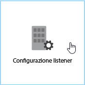
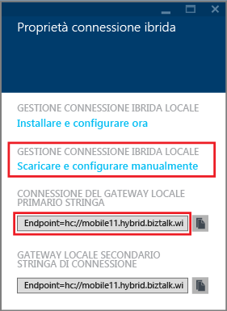
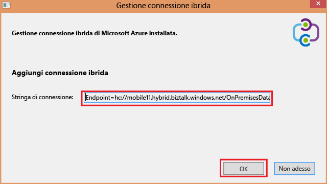
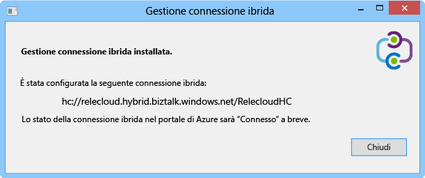
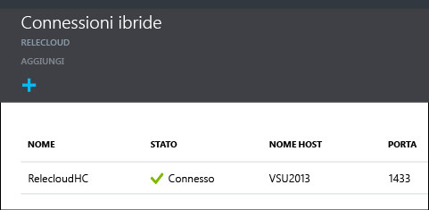

1. Nel pannello **Connessioni ibride** scegliere la connessione ibrida appena creata, quindi fare clic su **Installazione listener**.
	
	
	
4. Viene visualizzato il pannello **Proprietà connessioni ibride**. In **Gestione connessione ibrida locale** scegliere **scarica e configura manualmente**, salvare il pacchetto HybridConnectionManager.msi e quindi copiare la stringa di connessione del gateway.
	
	
	
5. Da un prompt dei comandi di amministratore, digitare il comando seguente per avviare il programma di installazione:

		start HybridConnectionManager.msi
 
7. Durante l'esecuzione del programma di installazione, fare clic su **Non adesso**, quindi passare alla cartella %Programmi%\\Microsoft\\HybridConnectionManager, eseguire HCMConfigWizard.exe e quindi fare clic su **Sì** nella finestra di dialogo **Controllo dell'account utente**.
		
7. Incollare la stringa di connessione ibrida copiata in precedenza e fare clic su **OK**.
	
	
	
8. Al termine dell'installazione fare clic su **Chiudi**.
	
	
	
	Nel pannello **Connessioni ibride** la colonna **Stato** ora visualizza **Connesso**.
	
	

<!---HONumber=AcomDC_1125_2015-->