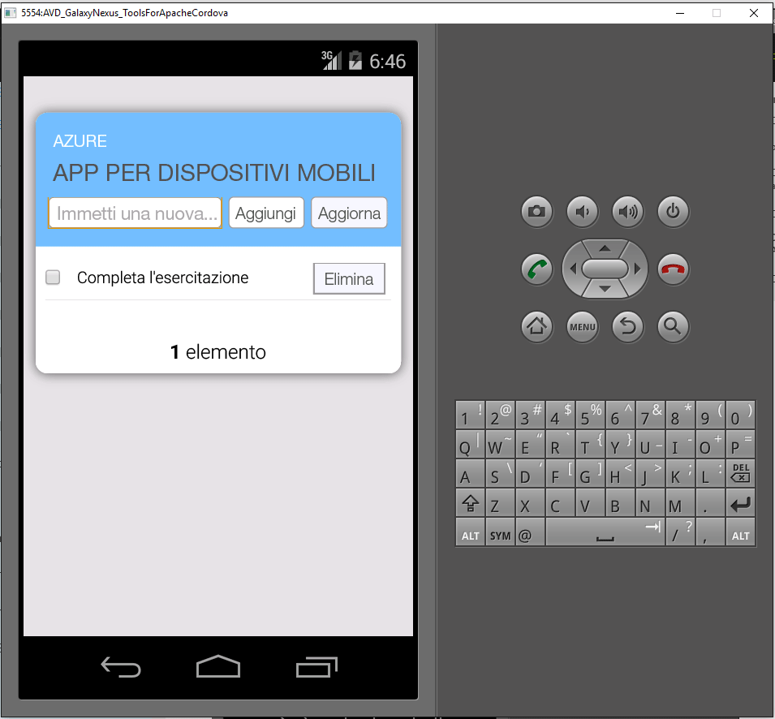

1. Visitare il [portale di Azure]. Fare clic su **Esplora tutto** > **App per dispositivi mobili** > e sul back-end appena creato. Nelle impostazioni dell'app per dispositivi mobili fare clic su **Quickstart** > **Cordova**. In **Configure your client application**, selezionare **Create a New App** e quindi fare clic su **Download**. In questo modo viene scaricato il progetto Cordova completo per un'app preconfigurata da connettere al back-end.
2. Decomprimere il file ZIP scaricato in una directory sul disco rigido, passare al file della soluzione con estensione sln e aprirlo con Visual Studio.
3. In Visual Studio scegliere la piattaforma della soluzione (Android, iOS o Windows) nell'elenco a discesa accanto alla freccia Inizio e quindi selezionare un emulatore o un dispositivo di distribuzione specifico facendo clic sull'elenco a discesa della freccia verde. Si noti che è possibile usare la piattaforma Android e l'emulatore Ripple predefiniti. Per esercitazioni più avanzate sarà necessario selezionare un dispositivo o un emulatore supportato.
4. Premere F5 o fare clic sulla freccia verde per compilare ed eseguire l'app Cordova. Se nell'emulatore viene visualizzata una finestra di dialogo di sicurezza che richiede di accedere alla rete, accettare.
5. Dopo l'avvio dell'app nel dispositivo o nell'emulatore, digitare un testo significativo in **Enter new text** (Immettere nuovo testo), ad esempio *Completare l'esercitazione* e quindi fare clic sul pulsante **Aggiungi**. Verrà inviata una richiesta POST al back-end di Azure distribuito in precedenza. Il back-end inserisce i dati della richiesta nella tabella TodoItem del database SQL e restituisce informazioni sugli elementi appena archiviati all'app per dispositivi mobili. L'app per dispositivi mobili consente di visualizzare questi dati nell'elenco.
   
    
6. Ripetere i tre passaggi precedenti per ogni piattaforma di dispositivi che si intende supportare.

[portale di Azure]: https://portal.azure.com/

<!---HONumber=AcomDC_0817_2016-->