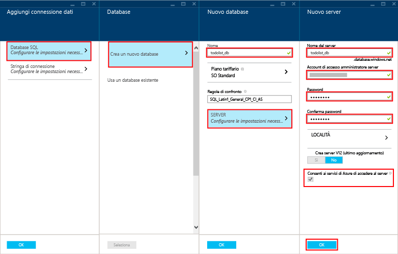

Per creare un nuovo back-end dell'app per dispositivi mobili, attenersi alla procedura seguente.

1. Accedere al [portale di Azure].

2. Nella parte superiore sinistra della finestra fare clic su **+NUOVO** > **Web e dispositivi mobili** > **App per dispositivi mobili** e quindi specificare un nome per il back-end dell'app per dispositivi mobili.

3. Nella casella **Gruppo di risorse** immettere lo stesso nome dell'app.

4. Verrà selezionato il piano del servizio app predefinito. Se si desidera modificare il piano del servizio app, fare clic sul piano del servizio app > **+ Crea nuovo**. Specificare un nome del nuovo piano del servizio app e selezionare un percorso appropriato. Fare clic su Livello di prezzo e selezionare un livello di prezzo appropriato per il servizio. Selezionare **Visualizza tutto** per visualizzare più opzioni sui prezzi, ad esempio **Free** e **Shared**. Dopo aver scelto il livello di prezzo, fare clic su **Seleziona**. Nel pannello del **piano del servizio app** fare clic su **OK**.

5. Fare clic su **Crea**. In questo modo, viene creato un back-end dell'app per dispositivi mobili in cui verrà in seguito distribuito il progetto server. L'esecuzione del provisioning di un back-end dell'app per dispositivi mobili può richiedere alcuni minuti. Dopo l'esecuzione del provisioning di un back-end dell'app per dispositivi mobili, verrà aperto il pannello **Impostazioni** per il back-end dell'app per dispositivi mobili. Nel passaggio successivo verrà creato un nuovo database SQL.

    > [AZURE.NOTE]Nel corso di questa esercitazione verranno creati una nuova istanza e un nuovo server di database SQL. È possibile riutilizzare questo nuovo database e amministrarlo allo stesso modo di qualsiasi altra istanza di database SQL. Se nella stessa posizione del nuovo back-end dell'app per dispositivi mobili è già presente un database, è possibile scegliere **Utilizza database esistente** e quindi selezionare questo database. Non è consigliabile usare un database in una posizione diversa, a causa dei costi aggiuntivi di larghezza di banda e di latenze più elevate.

6. Nel nuovo back-end dell'app per dispositivi mobili fare clic su **Impostazioni** > **App per dispositivi mobili** > **Dati** > **+Aggiungi**.

7. Nel pannello per l'**aggiunta di una connessione dati** fare clic su **Database SQL - Configura le impostazioni obbligatorie** > **Crea un nuovo database**. Immettere il nome del nuovo database nel campo **Nome**.

8. Fare clic su **Server**. Nel pannello del **nuovo server** immettere un nome di server univoco nel campo **Nome server** e specificare un **account di accesso amministratore server** e una **password** idonei. Verificare che l'opzione **Consenti ai servizi di Azure di accedere al server** sia selezionata. Fare clic su **OK**.

    

9. Nel pannello del **nuovo database** fare clic su **OK**.

10. Nel pannello per l'**aggiunta di una connessione dati** selezionare **Stringa di connessione** e immettere l'account di accesso e la password forniti al momento della creazione del database. Se si usa un database esistente, fornire le credenziali di accesso per il database. Dopo averle immesse fare clic su **OK**.

11. Nel pannello per l'**aggiunta di una connessione dati** fare nuovamente clic su **OK** per creare il database.

La creazione del database può richiedere alcuni minuti. Usare l'area **Notifiche** per monitorare l'avanzamento della distribuzione. L'avanzamento non viene eseguito se il database non è stato distribuito correttamente.

È stato eseguito il provisioning di un back-end dell'app per dispositivi mobili di Azure che può essere usato dalle applicazioni client per dispositivi mobili. Successivamente, scaricare un progetto server per un semplice back-end "todo list" e pubblicarlo in Azure.

<!-- URLs. -->
[portale di Azure]: https://portal.azure.com/

<!---HONumber=Oct15_HO3-->