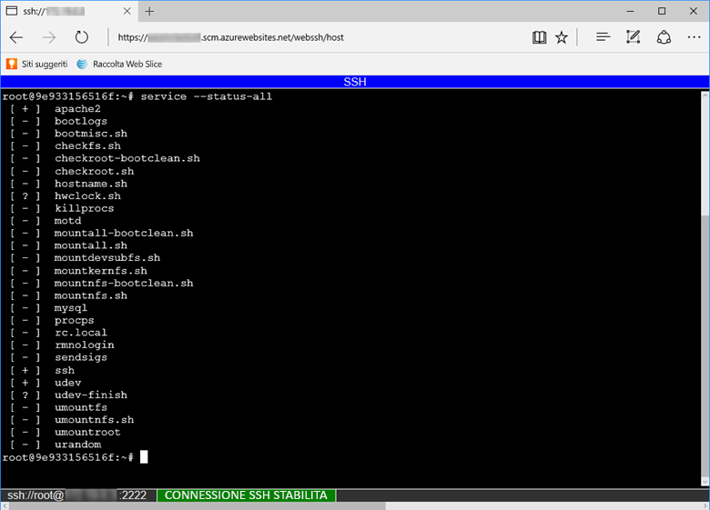

Per aprire una sessione SSH diretta con il contenitore, l'app deve essere in esecuzione.

Incollare l'URL seguente nel browser e sostituire \<app-name> con il nome dell'app:

```
https://<app-name>.scm.azurewebsites.net/webssh/host
```

Se non lo si è già fatto, per connettersi è necessario eseguire l'autenticazione con la sottoscrizione di Azure. Al termine dell'autenticazione viene visualizzata una shell nel browser, in cui è possibile eseguire i comandi all'interno del contenitore.


