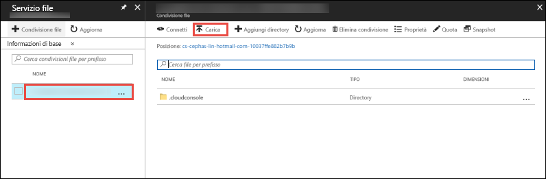

Nel [portale di Azure](https://portal.azure.com) fare clic su **Gruppi di risorse** > **cloud-shell-storage-\<your_region>** > **\<storage_account_name>**.


Nella pagina **Panoramica** dell'account di archiviazione selezionare **File**.

Selezionare la condivisione file generata automaticamente e quindi fare clic su **Carica**. La condivisione file viene montata in Cloud Shell come `clouddrive`.



Fare clic sul selettore di file e selezionare il file ZIP, quindi fare clic su **Carica**. 

In Cloud Shell usare `ls` per verificare che il file ZIP caricato sia visualizzato nella condivisione `clouddrive` predefinita.

```azurecli-interactive
ls clouddrive
```
