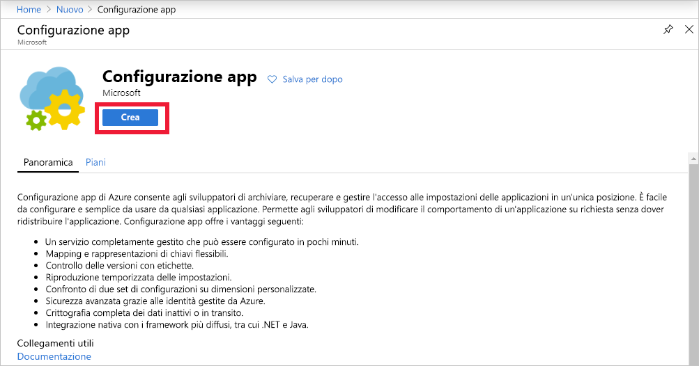

1. Per creare un nuovo archivio di Configurazione app, accedere al [portale di Azure](https://portal.azure.com). Nell'angolo superiore sinistro della home page selezionare **Crea una risorsa**. Nella casella **Cerca nel Marketplace** immettere *Configurazione app* e quindi premere <kbd>INVIO</kbd>.

    

1. Nei risultati della ricerca selezionare **Configurazione app** e quindi selezionare **Crea**.

    

1. Nel riquadro **Crea configurazione dell'app** immettere le impostazioni seguenti:

    | Impostazione | Valore consigliato | Descrizione |
    |---|---|---|
    | **Sottoscrizione** | Sottoscrizione in uso | Selezionare la sottoscrizione di Azure da usare per testare Configurazione app. Se l'account ha una sola sottoscrizione, questa viene selezionata automaticamente e l'elenco **Sottoscrizione** non viene visualizzato. |
    | **Gruppo di risorse** | *AppConfigTestResources* | Selezionare o creare un gruppo di risorse per la risorsa archivio di Configurazione app. Questo gruppo è utile per gestire risorse multiple: ad esempio è possibile eliminare più risorse con un'unica operazione, eliminando il gruppo di risorse. Per altre informazioni, vedere [Usare i gruppi di risorse per gestire le risorse di Azure](../articles/azure-resource-manager/management/overview.md). |
    | **Nome risorsa** | Nome globalmente univoco | Immettere un nome di risorsa univoco da usare per la risorsa archivio di Configurazione app. Il nome deve essere una stringa contenente da 5 a 50 caratteri costituiti solo da numeri, lettere e dal carattere `-`. Il nome non può iniziare o terminare con il carattere `-`. |
    | **Posizione** | *Stati Uniti centrali* | Usare **Posizione** per specificare la posizione geografica in cui viene ospitato l'archivio di configurazione app. Per ottenere prestazioni ottimali, creare le risorse nella stessa area degli altri componenti dell'applicazione. |
    | **Piano tariffario** | *Free* | Selezionare il piano tariffario desiderato. Per altre informazioni, vedere la [pagina dei prezzi di Configurazione app](https://azure.microsoft.com/pricing/details/app-configuration). |

1. Selezionare **Rivedi e crea** per convalidare le impostazioni.

1. Selezionare **Create** (Crea). La distribuzione può richiedere alcuni minuti.

1. Al termine della distribuzione, passare alla risorsa Configurazione app. Selezionare **Impostazioni** > **Chiavi di accesso**. Prendere nota della stringa di connessione della chiave primaria di sola lettura. Questa stringa di connessione verrà usata in seguito per configurare l'applicazione in modo da comunicare con l'archivio di Configurazione app creato.