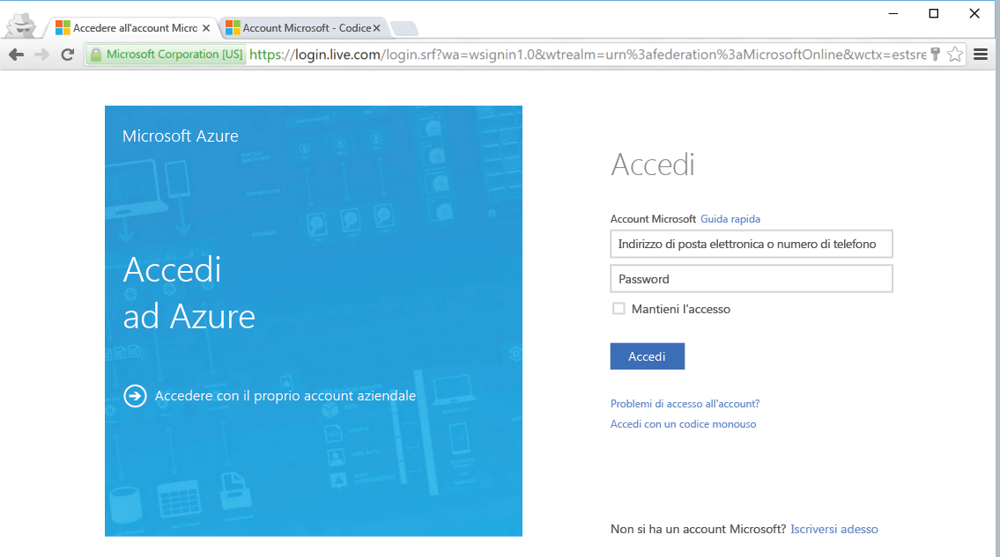

<!--
includes/azure-include-getting-started-v12portal-gettings-an-account.md

Latest Freshness check:  2016-04-11 , carlrab.

As of circa 2016-04-11, the following topics might include this include:
articles/sql-database/sql-database-get-started-tutorial.md

-->
## Connettersi al portale di Azure con una sottoscrizione
Per connettersi al portale di Azure, è necessaria una sottoscrizione.

### Ottenere un nuovo account
Se non si ha già un account Azure, scegliere una delle opzioni seguenti per ottenere un account:

* Ottenere un [account gratuito](https://azure.microsoft.com/get-started/).
* Usare una [sottoscrizione MSDN](https://azure.microsoft.com/pricing/member-offers/msdn-benefits/).

### Accedere usando un account esistente
Usando la [sottoscrizione esistente](https://account.windowsazure.com/Home/Index), seguire questa procedura per connettersi al portale di Azure.

1. Aprire il browser preferito e connettersi al [portale di Azure](https://portal.azure.com/).
2. Accedere al [portale di Azure](https://portal.azure.com/).
3. Nella **pagina di accesso** specificare le credenziali per la sottoscrizione.
   
   

<!--HONumber=Nov16_HO2-->

