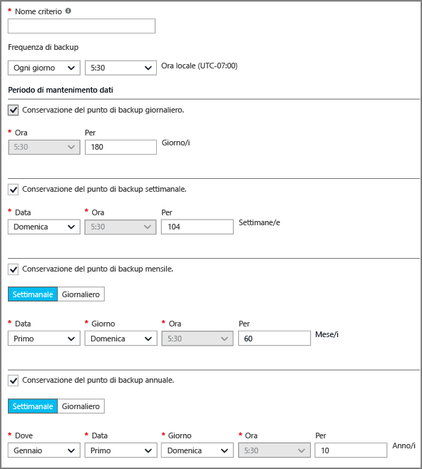

## Definizione di un criterio di backup
Un criterio di backup definisce una matrice relativa a quando sono stati acquisiti gli snapshot dei dati e per quanto tempo tali snapshot vengono conservati. Quando si definisce un criterio per il backup di una VM è possibile attivare un processo di backup *una volta al giorno*. Quando si crea un nuovo criterio, viene applicato all'insieme di credenziali. L'interfaccia del criterio di backup è simile alla seguente:

Per creare un criterio:

1. Immettere un nome in **Nome criterio**.
2. Gli snapshot dei dati possono essere acquisiti a intervalli giornalieri o settimanali. Usare il menu a discesa **Frequenza di backup** per scegliere se acquisire gli snapshot dei dati ogni giorno o ogni settimana.

   * Se si sceglie un intervallo giornaliero, usare il controllo evidenziato per selezionare l'ora del giorno per lo snapshot. Per modificare l'ora, deselezionarla e selezionare quella nuova.

       
   * Se si sceglie un intervallo settimanale, usare i controlli evidenziati per selezionare uno o più giorni della settimana e l'ora del giorno in cui acquisire lo snapshot. Nel menu dei giorni selezionare uno o più giorni. Nel menu delle ore selezionare un'ora. Per modificare l'ora, deselezionare quella selezionata e selezionare quella nuova.

     
3. Per impostazione predefinita, tutte le opzioni di **Intervallo conservazione** sono selezionate. Deselezionare i limiti dell'intervallo di conservazione che non si vuole usare. Specificare quindi uno o più intervalli da usare.

    Gli intervalli di conservazione mensili e annuali consentono di specificare gli snapshot basati su un incremento settimanale o giornaliero.

   > [!NOTE]
   > 
   > - Quando si protegge una VM, una volta al giorno viene eseguito un processo di backup. L'ora in cui il backup viene eseguito è la stessa per ogni intervallo di conservazione.
   > - Il punto di ripristino viene generato nella data e all'ora di completamento dello snapshot di backup, indipendentemente dalla pianificazione del processo di backup.
   >   - Esempio: Se si pianifica la frequenza di backup alle 23:30 e a causa di problemi lo snapshot viene completato alle 00:01, il punto di ripristino verrà creato con la data del giorno successivo e l'ora 00:01.
   > - In caso di backup mensile, se il backup è impostato per l'esecuzione il primo giorno di ogni mese e lo snapshot viene completato il giorno successivo a causa di un problema, il punto di ripristino creato per il backup mensile verrà contrassegnato con il giorno successivo (ad esempio, il secondo giorno del mese).

4. Dopo avere impostato tutte le opzioni per il criterio, nella parte superiore del pannello fare clic su **Salva**.

    Il nuovo criterio verrà immediatamente applicato all'insieme di credenziali.
