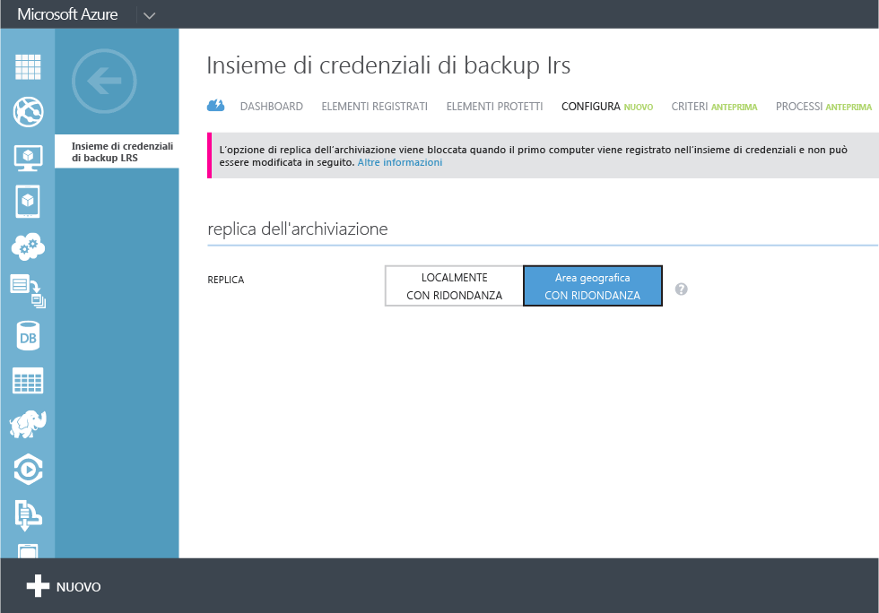
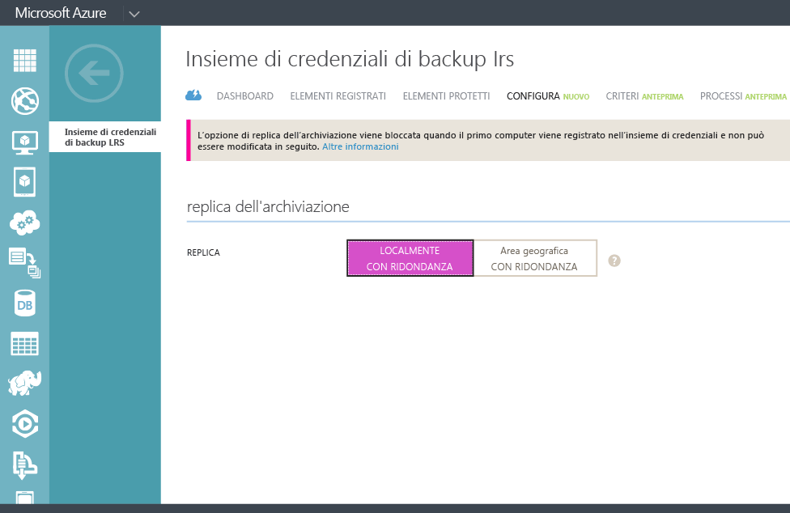

## Creare un insieme di credenziali per il backup
Per eseguire in Azure il backup di file e dati da Windows Server o da System Center Data Protection Manager (SCDPM) oppure il backup di macchine virtuali IaaS, è necessario creare un insieme di credenziali per il backup nell'area geografica in cui si desidera archiviare i dati.

La procedura seguente illustra la creazione dell'insieme di credenziali utilizzate per archiviare i backup.

1. Accedere al [portale di gestione](https://manage.windowsazure.com/).
2. Fare clic su **Nuovo** -> **Servizi dati** -> **Servizi di ripristino** -> **Insieme di credenziali per il backup** e scegliere **Creazione rapida**.

    

3. Per il parametro **Nome** immettere un nome descrittivo per identificare l'insieme di credenziali di backup. È necessario che il nome sia univoco per ogni sottoscrizione.

4. Per il parametro **Area** selezionare l'area geografica per l'insieme di credenziali per il backup. La scelta determina l'area geografica a cui viene inviati i dati di backup. Scegliendo un'area geografica vicina alla propria posizione, è possibile ridurre la latenza di rete durante il backup in Azure.

5. Fare clic su **Crea insieme di credenziali** per completare il flusso di lavoro. La creazione dell'insieme di credenziali per il backup può richiedere alcuni minuti. Per verificare lo stato, è possibile monitorare le notifiche nella parte inferiore del portale.

    

6. Dopo aver creato l'archivio di backup, un messaggio che indica che l'insieme di credenziali è stato creato correttamente. L'insieme di credenziali viene inoltre elencato nelle risorse di servizi di ripristino come**Active**.

    

### Backup di Azure: opzioni di ridondanza di archiviazione

È consigliabile identificare l'opzione di ridondanza di archiviazione subito dopo la creazione dell'insieme di credenziali e prima che i computer vengano registrati nell'insieme di credenziali. Dopo la registrazione di un elemento nell'insieme di credenziali, l'opzione di ridondanza di archiviazione è bloccata e non può essere modificata.

La ridondanza di archiviazione dell'archiviazione back-end di Backup di Azure è determinata in base alle esigenze aziendali. Se si usa Azure come endpoint primario di archiviazione dei backup (se ad esempio si esegue il backup in Azure da Windows Server), è consigliabile scegliere l'opzione predefinita di archiviazione con ridondanza geografica. Questa opzione viene visualizzata nella sezione **Configura** dell'insieme di credenziali per il backup.

#### Archiviazione con ridondanza geografica (GRS)
Con tale tipo di archiviazione vengono conservate sei copie dei dati. Con questa opzione di replica, i dati vengono replicati per tre volte all'interno dell'area primaria e per tre volte in un'area secondaria situata a centinaia di chilometri di distanza dall'area primaria, fornendo il massimo livello di durabilità. In caso di errore nell'area primaria, grazie all'archiviazione con ridondanza geografica, Backup di Azure assicura la durabilità dei dati in due aree distinte.

#### Archiviazione con ridondanza locale (LRS)
Con l'archiviazione con ridondanza locale vengono conservate tre copie dei dati. Tale tipo di archiviazione viene replicato per tre volte all'interno di una singola struttura di una singola area. Questo tipo di archiviazione protegge i dati dai comuni errori hardware, ma non dagli errori di un'intera struttura Azure.

Se si usa Azure come endpoint terziario di archiviazione dei backup (se ad esempio si usa SCDPM per avere una copia locale del backup e si usa Azure per la conservazione a lungo termine), è consigliabile scegliere l'archiviazione con ridondanza locale nell'opzione **Configura** dell'insieme di credenziali per il backup. In questo modo vengono ridotti i costi di archiviazione dei dati in Azure e viene offerta una durabilità dei dati inferiore che può essere accettabile per le copie terziarie.

<!---HONumber=July15_HO3-->