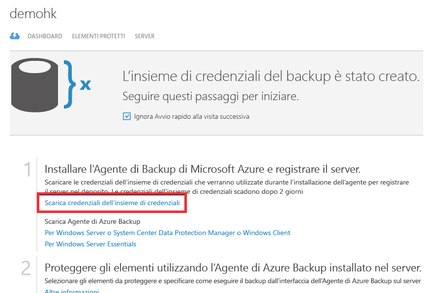

## Uso delle credenziali di insieme per l'autenticazione con il servizio Backup di Azure
Per poter eseguire il backup dei dati in Azure, è necessario autenticare il server locale (Windows client, Windows Server o server SCDPM) con un insieme di credenziali per il backup. L'autenticazione viene eseguita mediante le "credenziali di insieme". Il concetto di credenziali di insieme è simile al concetto di un file di "impostazioni di pubblicazione" usato in Azure PowerShell.

### Informazioni sul file delle credenziali di insieme
Il file delle credenziali di insieme è un certificato generato dal portale per ogni insieme di credenziali per il backup. Il portale carica quindi la chiave pubblica nel Servizio di controllo di accesso (o ACS). La chiave privata del certificato viene resa disponibile per l'utente come parte del flusso di lavoro indicato come input nel flusso di lavoro di registrazione del computer. In questo modo viene eseguita l'autenticazione del computer per l'invio dei dati di backup a un insieme di credenziali identificato nel servizio Backup di Azure.

Il file delle credenziali di insieme viene usato solo durante il flusso di lavoro di registrazione. È responsabilità dell'utente garantire che il file delle credenziali di insieme non venga danneggiato. Nelle mani di un utente non autorizzato il file delle credenziali di insieme può essere usato per registrare altri computer nello stesso insieme di credenziali. Poiché i dati di backup sono crittografati tramite una passphrase appartenente al cliente, i dati di backup esistenti non possono tuttavia essere compromessi. Per attenuare questo problema, le credenziali dell'insieme di credenziali sono impostate per scadere in 48hrs. È possibile scaricare le credenziali di insieme di un insieme di credenziali per il backup un numero illimitato di volte, ma durante la registrazione del flusso di lavoro è applicabile solo il file delle credenziali di insieme più recente.

### Scaricare il file delle credenziali di insieme
Il file delle credenziali di insieme viene scaricato dal portale di Azure tramite un canale sicuro. Il servizio Backup di Azure non è a conoscenza della chiave privata del certificato e la chiave privata non è persistente nel portale o nel servizio. Usare la procedura seguente per scaricare le credenziali di insieme in un computer locale.

1. Accedere al [portale di gestione](https://manage.windowsazure.com/)
2. Fare clic su **Servizi di ripristino** nel pannello di navigazione sinistro e selezionare l'insieme di credenziali per il backup creato. Fare clic sull'icona del cloud per visualizzare la vista Avvio rapido dell'insieme di credenziali per il backup.
   
   
3. Nella pagina Avvio rapido fare clic su **Scarica credenziali di insieme**. Il portale genera il file delle credenziali di insieme, che diventa disponibile per il download.
   
   
4. Il portale genererà una credenziale di insieme usando una combinazione del nome dell'insieme di credenziali e della data attuale. Fare clic su **Salva** per scaricare le credenziali di insieme nella cartella di download dell'account locale o selezionare Salva con nome dal menu Salva per specificare un percorso per le credenziali.

### Nota
* Assicurarsi che le credenziali di insieme vengano salvate in un percorso accessibile dal computer. Se vengano archiviate in una condivisione file/SMB, verificare le autorizzazioni di accesso.
* Il file delle credenziali di insieme viene usato solo durante il flusso di lavoro di registrazione.
* Il file delle credenziali di insieme scade dopo 48 ore e può essere scaricato dal portale.
* Per domande sul flusso di lavoro, fare riferimento alle [domande frequenti](../articles/backup/backup-azure-backup-faq.md) di Backup di Azure.

<!--HONumber=Nov16_HO3-->

