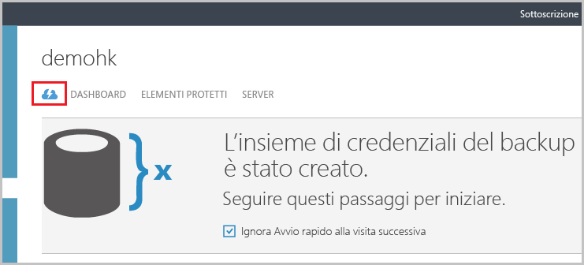
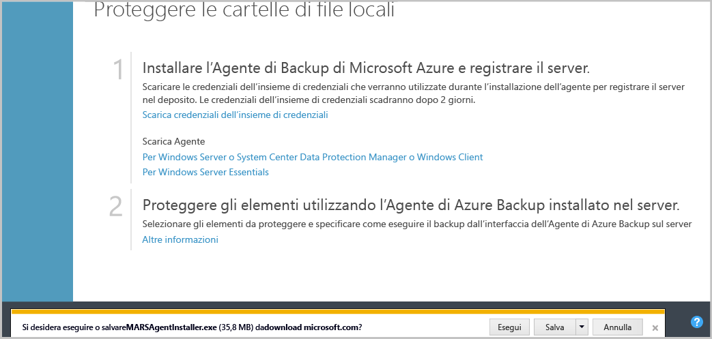
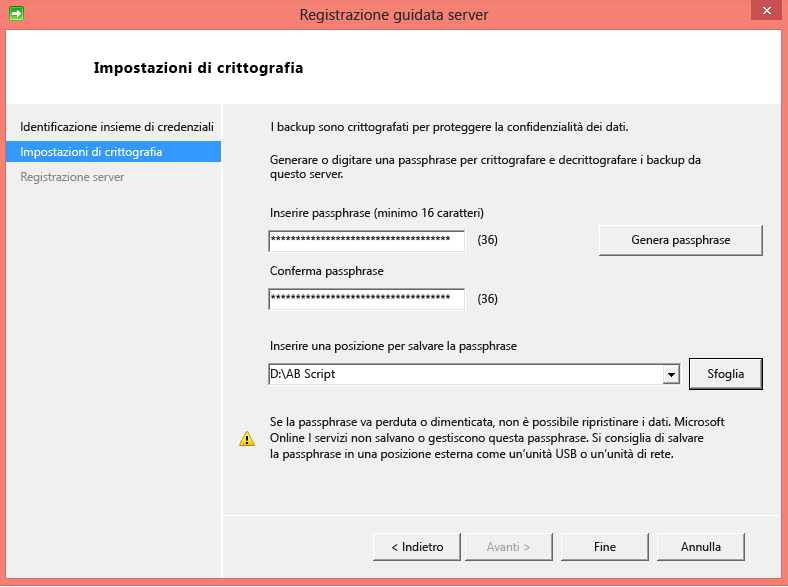
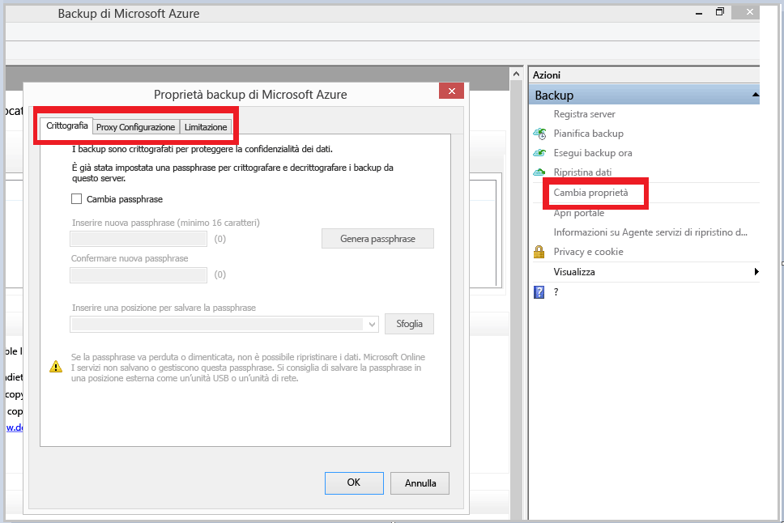
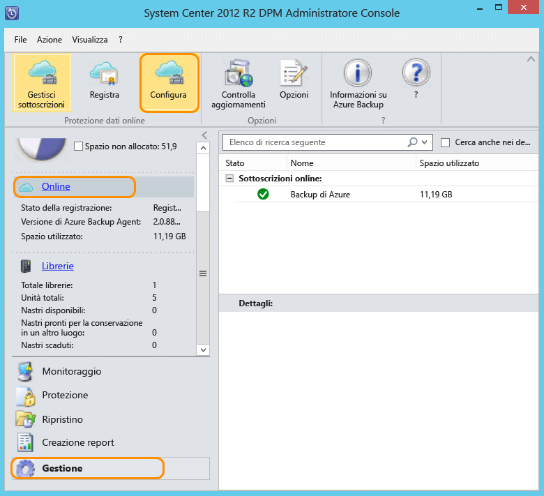

## Scaricare, installare e registrare l'agente backup di Azure

Dopo aver creato l'insieme di credenziali di Backup di Azure, è necessario installare un agente in ogni server locale (Windows Server, client Windows o server System Center Data Protection Manager) per eseguire il backup dei dati e dell'applicazione in Azure.

1. Accedere al [portale di gestione](https://manage.windowsazure.com/).

2. Fare clic su **Servizi di ripristino**, quindi selezionare l'insieme di credenziali per il backup da registrare con un server. Viene visualizzata la pagina Avvio rapido per quell'insieme di credenziali per il backup.

    

3. Nella pagina Avvio rapido fare clic sull’opzione **Per Windows Server, System Center Data Protection Manager o client Windows** in **Agente download**. Fare clic su **Salva** per copiarlo nel computer locale.

    

4. Dopo aver installato l'agente, fare doppio clic su MARSAgentInstaller.exe per avviare l'installazione dell'agente Backup di Azure. Scegliere la cartella di installazione e la cartella Scratch necessarie per l'agente. Il percorso della cache specificato deve disporre di uno spazio libero pari almeno al 5% dei dati di backup.

5.	Se si usa un server proxy per connettersi a Internet, nella schermata **Configurazione proxy** immettere i dettagli del server proxy. Se si usa un proxy autenticato, immettere il nome utente e la password in questa schermata.

6.	Per completare l'installazione, l'agente Backup di Azure installerà .NET Framework 4.5 e Windows PowerShell (se non è già disponibile).

7.	Dopo aver installato l'agente, fare clic sul pulsante **Procedi alla registrazione** per continuare con il flusso di lavoro.

    

8. Nella schermata relativa alle credenziali di insieme individuare e selezionare il file delle credenziali di insieme scaricato in precedenza.

    

    Il file delle credenziali di insieme è valido solo per 48 ore dopo che è stato scaricato dal portale. Se si verifica un errore in questa schermata, ad esempio "Il file delle credenziali di insieme fornito è scaduto", accedere al portale di Azure e scaricare nuovamente il file delle credenziali di insieme.

    Verificare che il file delle credenziali di insieme sia disponibile in un percorso accessibile dall'applicazione di installazione. Se si verificano errori relativi all'accesso, copiare il file delle credenziali di insieme in un percorso temporaneo nel computer e ripetere l'operazione.

    Se si verifica un errore di credenziali dell'insieme di credenziali non valido (ad esempio "credenziali di archivio non valide fornite") il file è danneggiato o non sono quelle più recenti associate al servizio di recupero. Ripetere l'operazione dopo avere scaricato un nuovo file di archivio delle credenziali dal portale. Questo errore in genere si verifica se l'utente fa clic sull'opzione **Scarica credenziali di insieme** nel portale di Azure in rapida successione. In questo caso è valido solo il secondo file delle credenziali di insieme.

9. Nella schermata **impostazione crittografia**, è possibile generare una passphrase o fornire una passphrase (almeno 16 caratteri). Ricordarsi di salvare la passphrase in un luogo sicuro.

    

    > [AZURE.WARNING]Se la passphrase viene persa o dimenticata, Microsoft non potrà fornire assistenza per il recupero dei dati di backup. L'utente finale possiede la passphrase di crittografia, che non è visibile a Microsoft. Salvare il file in un luogo sicuro, in quanto potrebbe essere necessario durante un'operazione di ripristino.

10. Dopo aver selezionato il pulsante **Fine**, il computer sarà registrato nell'insieme di credenziali e sarà possibile avviare il backup in Microsoft Azure.

11. È possibile modificare le impostazioni specificate durante la registrazione del flusso di lavoro facendo clic sull'opzione **Modifica proprietà** nello snap-in di MMC di Backup di Microsoft Azure.

    

    In alternativa, quando si utilizza Data Protection Manager, è possibile modificare le impostazioni specificate durante il flusso di lavoro di registrazione facendo clic sull’opzione **Configura** selezionando **Online** sotto la scheda **Management**.

    

<!---HONumber=July15_HO3-->