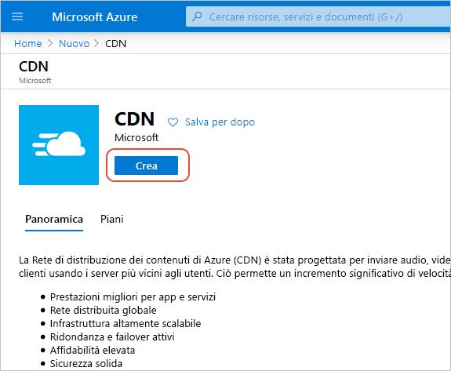
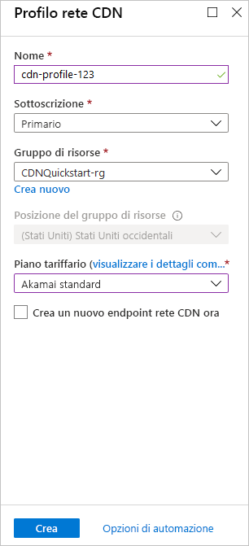

## Creare un nuovo profilo di rete CDN

Un profilo di rete CDN è un contenitore per endpoint della rete CDN e specifica un piano tariffario.

1. In alto a sinistra nel portale di Azure selezionare **Crea una risorsa**. 
    
    Viene visualizzato il riquadro **Nuovo**.
   
2. Selezionare **Web e dispositivi mobili**, quindi **Rete CDN**.
   
    

    Viene visualizzato il riquadro **Profilo rete CDN**.

3. Per le impostazioni del profilo della rete CDN, usare i valori specificati nella tabella seguente:
   
    | Impostazione  | Valore |
    | -------- | ----- |
    | **Nome** | Immettere *my-cdn-profile-123* per il nome del profilo. Il nome deve essere univoco a livello globale. Se è già in uso, è possibile immettere un nome diverso. |
    | **Sottoscrizione** | Selezionare una sottoscrizione di Azure dall'elenco a discesa. |
    | **Gruppo di risorse** | Selezionare **Crea nuovo** e immettere *my-resource-group-123* per il nome del gruppo di risorse. Il nome deve essere univoco a livello globale. Se è già in uso, è possibile immettere un nome diverso o è possibile selezionare **Usa esistente** e selezionare **my-resource-group-123** nell'elenco a discesa. | 
    | **Località del gruppo di risorse** | Selezionare **Stati Uniti centrali** dall'elenco a discesa. |
    | **Piano tariffario** | Selezionare **Verizon standard** dall'elenco a discesa. |
    | **Crea un nuovo endpoint rete CDN ora** | Non selezionare alcun elemento. |  
   
    

4. Selezionare **Aggiungi al dashboard** per salvare il profilo nel dashboard dopo la creazione.
    
5. Selezionare **Crea** per creare il profilo. 

    Solo per i profili di **rete CDN Standard di Azure con tecnologia Microsoft**, il completamento del profilo richiede in genere due ore. 

