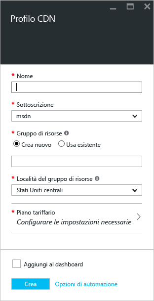
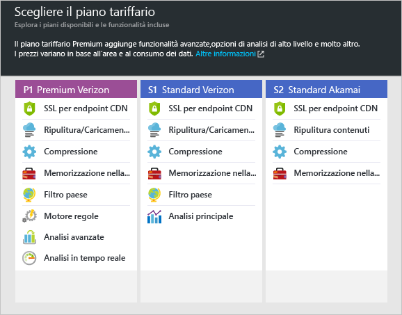

**Per creare un nuovo profilo di rete CDN**

1. Nel [portale di Azure](https://portal.azure.com)fare clic su **Nuovo**in alto a sinistra.  Nel pannello **Nuovo** selezionare **Web e dispositivi mobili** e quindi **Rete CDN**.
   
    Viene visualizzato il pannello del nuovo profilo di rete CDN.
   
    
2. Inserire un nome per il profilo di rete CDN.
3. Selezionare un **percorso**.  Questo è il percorso di Azure in cui verranno archiviate le informazioni relative al profilo di rete CDN.  Non incide sulle posizioni dell’endpoint di rete CDN.
4. Selezionare o creare un **gruppo di risorse**.  Per altre informazioni sui gruppi di risorse, vedere [Panoramica di Azure Resource Manager](../articles/azure-resource-manager/resource-group-overview.md#resource-groups).
5. Selezionare un **Piano tariffario**.  Per un confronto tra i piani tariffari, vedere [Panoramica della rete CDN](../articles/cdn/cdn-overview.md#azure-cdn-features) .
   
    
6. Selezionare la **Sottoscrizione** per questo profilo di rete CDN.
7. Per creare il nuovo profilo, fare clic sul pulsante **Crea** . 

