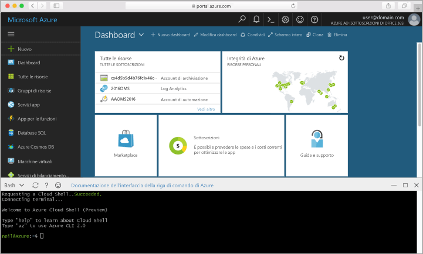

## Avviare Azure Cloud Shell

Azure Cloud Shell è una shell Bash gratuita che può essere eseguita direttamente nel portale di Azure. Include l'interfaccia della riga di comando di Azure preinstallata e configurata per l'uso con l'account. Fare clic sul pulsante **Cloud Shell** nel menu nel riquadro in alto a destra nel [portale di Azure](https://portal.azure.com).

Il pulsante avvia una shell interattiva che è possibile usare per eseguire i passaggi di questo argomento:

