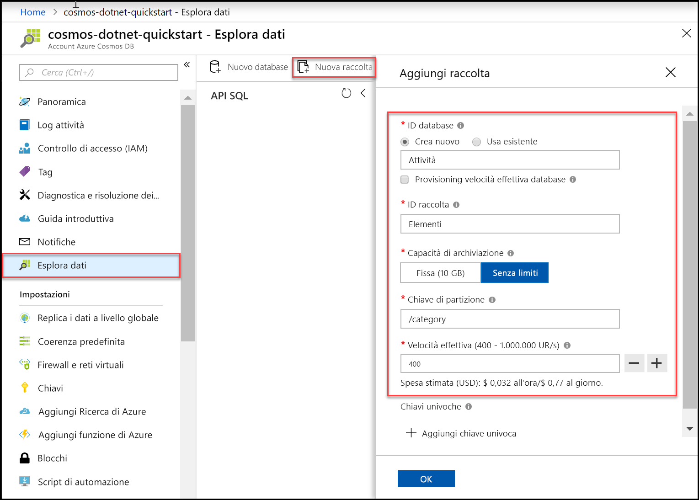

È ora possibile usare lo strumento Esplora dati nel portale di Azure per creare un database e una raccolta. 

1. Fare clic su **Esplora dati** > **Nuova raccolta**. 
    
    A destra verrà visualizzata l'area **Aggiungi raccolta**. Per vederla potrebbe essere necessario scorrere verso destra.

    

2. Nella pagina **Aggiungi raccolta** immettere le impostazioni per la nuova raccolta.

    Impostazione|Valore consigliato|DESCRIZIONE
    ---|---|---
    ID database|*Attività*|Immettere *Tasks* come nome del nuovo database. I nomi dei database devono avere una lunghezza compresa tra 1 e 255 caratteri e non possono contenere /, \\, #, ? o spazi finali.
    ID raccolta|*Items*|Immettere *Items* come nome della nuova raccolta. Gli ID delle raccolte prevedono gli stessi requisiti relativi ai caratteri dei nomi di database.
    Effettuare il provisioning della velocità effettiva di database|Lasciare vuoto|Azure Cosmos DB può effettuare il provisioning della velocità effettiva a livello di database (tutte le raccolte in un database di condivideranno la stessa velocità effettiva) o a livello di raccolta. Lasciare vuoto per effettuare il provisioning della velocità effettiva a livello di raccolta per questa specifica raccolta.
    Capacità di archiviazione|*Illimitato*|Scegliere la capacità di archiviazione **Illimitata**. 
    Chiave di partizione|*/category*|Immettere "/category" come chiave di partizione. L'impostazione di una chiave di partizione consente ad Azure Cosmos DB di ridimensionare la raccolta per soddisfare le esigenze di archiviazione e velocità effettiva dell'applicazione. In generale, una scelta appropriata per la chiave di partizione è una con un'ampia gamma di valori distinti, che consenta la distribuzione uniforme dei volumi di archiviazione e richieste per il carico di lavoro. [Altre informazioni sul partizionamento.](../articles/cosmos-db/partitioning-overview.md)
    Velocità effettiva|*400 UR/sec*|Modificare la velocità effettiva in 400 unità richiesta al secondo (UR/sec). Se si vuole ridurre la latenza, è possibile aumentare la velocità effettiva in un secondo momento. 
    
    Oltre alle impostazioni precedenti, è possibile aggiungere **Chiavi univoche** per la raccolta. In questo esempio il campo viene lasciato vuoto. Le chiavi univoche consentono agli sviluppatori di aggiungere un livello di integrità dei dati nel database. Se si definiscono criteri di chiave univoca durante la creazione di una raccolta, si ha la sicurezza che uno o più valori siano univoci per ogni chiave di partizione. Per altre informazioni, vedere l'articolo [Chiavi univoche in Azure Cosmos DB](../articles/cosmos-db/unique-keys.md).
    
    Fare clic su **OK**.

    In Esplora dati verranno visualizzati il nuovo database e la nuova raccolta.

    