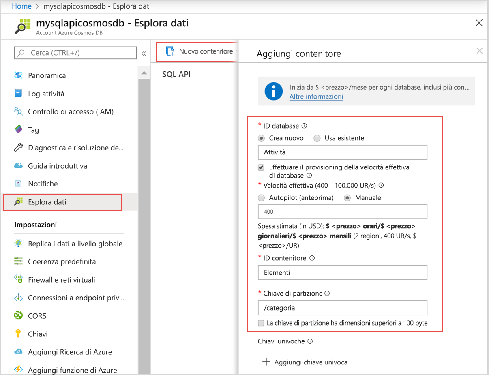

È ora possibile usare Esplora dati per creare una raccolta e aggiungere dati al database. 

1. Nel menu di navigazione a sinistra del portale di Azure fare clic su **Esplora dati (anteprima)**. 

2. Nel pannello **Esplora dati (anteprima)** fare clic su **Nuova raccolta** e quindi specificare le informazioni seguenti:

    

    Impostazione|Valore consigliato|Descrizione
    ---|---|---
    ID database|Attività|ID del nuovo database. I nomi dei database devono avere una lunghezza compresa tra 1 e 255 caratteri e non possono contenere /, \\, #, ? o spazi finali.
    ID raccolta|Items|ID della nuova raccolta. I nomi delle raccolte prevedono requisiti per i caratteri uguali a quelli degli ID dei database.
    Capacità di archiviazione| Fissa (10 GB)|Usare il valore predefinito. Indica la capacità di archiviazione del database.
    Velocità effettiva|400 UR|Usare il valore predefinito. Se si vuole ridurre la latenza, è possibile aumentare la velocità effettiva in un secondo momento.
    UR/min|Off|Lasciare il valore predefinito. Se in seguito sarà necessario gestire carichi di lavoro di picco, sarà possibile attivare la funzionalità [UR/min](../articles/cosmos-db/request-units-per-minute.md) al momento.
    Chiave di partizione|/category|Chiave di partizione che distribuisce i dati in modo uniforme a ogni partizione. Quando si crea una raccolta ad alte prestazioni è importante selezionare la chiave di partizione corretta. Per altre informazioni, vedere [Progettazione per il partizionamento](../articles/cosmos-db/partition-data.md#designing-for-partitioning).    
3. Dopo aver completato il modulo, fare clic su **OK**.