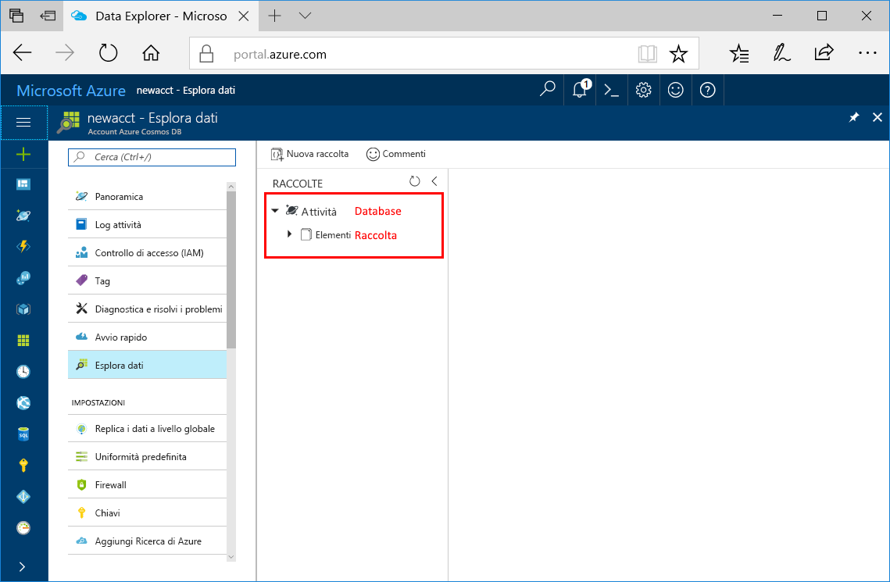

È ora possibile usare lo strumento Esplora dati nel portale di Azure per creare un database e una raccolta. 

1. Fare clic su **Esplora dati** > **Nuova raccolta**. 
    
    A destra verrà visualizzata l'area **Aggiungi raccolta**. Per vederla potrebbe essere necessario scorrere verso destra.

    

2. Nella pagina **Aggiungi raccolta** immettere le impostazioni per la nuova raccolta.

    Impostazione|Valore consigliato|Descrizione
    ---|---|---
    ID database|Attività|Immettere *Tasks* come nome del nuovo database. I nomi dei database devono avere una lunghezza compresa tra 1 e 255 caratteri e non possono contenere /, \\, #, ? o spazi finali.
    ID raccolta|Items|Immettere *Items* come nome della nuova raccolta. Gli ID delle raccolte prevedono gli stessi requisiti relativi ai caratteri dei nomi di database.
    Capacità di archiviazione| Fissa (10 GB)|Modificare il valore in **Fissa (10 GB)**. Questo valore indica la capacità di archiviazione del database.
    Velocità effettiva|400 UR|Modificare la velocità effettiva in 400 unità richiesta al secondo (UR/sec). La capacità di archiviazione deve essere impostata su **Fisso (10 GB)** per impostare la velocità effettiva su 400 UR/sec. Se si vuole ridurre la latenza, è possibile aumentare la velocità effettiva in un secondo momento. 
    Chiave di partizione|/category|Immettere */category* come chiave di partizione. Una chiave di partizione che distribuisce i dati in modo uniforme a ogni partizione del database. Per altre informazioni sul partizionamento, vedere [Progettazione per il partizionamento](../articles/cosmos-db/partition-data.md#designing-for-partitioning).

    Fare clic su **OK**.

    In Esplora dati verranno visualizzati il nuovo database e la nuova raccolta.

    