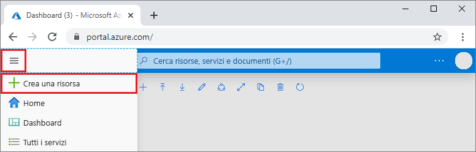
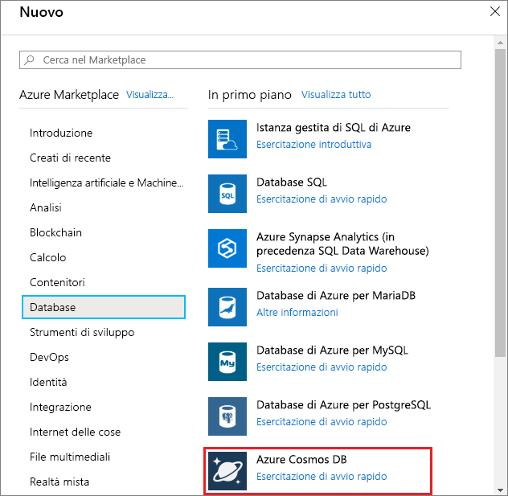
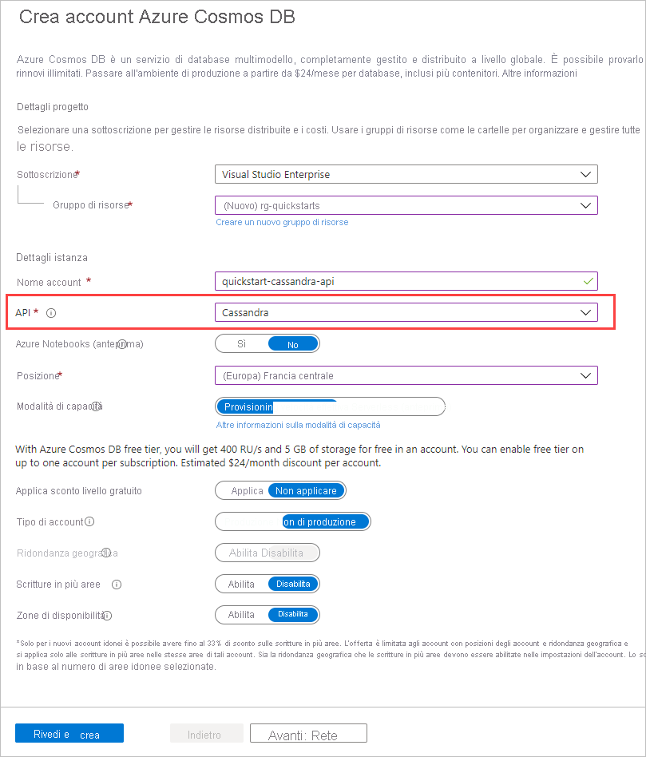

1. In una nuova finestra del browser accedere al [portale di Azure](https://portal.azure.com/).

2. Nel menu a sinistra selezionare **Crea una risorsa**.
   
   
   
3. Nella pagina **Nuovo** selezionare **Database** > **Azure Cosmos DB**.
   
   
   
3. Nella pagina **Crea account Azure Cosmos DB** immettere le impostazioni per il nuovo account Azure Cosmos DB. 
 
    Impostazione|valore|Descrizione
    ---|---|---
    Subscription|Sottoscrizione in uso|Selezionare la sottoscrizione di Azure da usare per l'account Azure Cosmos DB. 
    Gruppo di risorse|Creare un nuovo gruppo di risorse  Immettere quindi lo stesso nome specificato nome dell'account.|Selezionare **Crea nuovo**. Immettere quindi il nome di un nuovo gruppo di risorse per l'account. Per semplicità, usare lo stesso nome usato come nome dell'account Azure Cosmos. 
    Nome account|Immettere un nome univoco|Immettere un nome univoco per identificare l'account Azure Cosmos DB. L'URI dell'account sarà *cassandra.cosmos.azure.com* e verrà aggiunto al nome dell'account univoco.  Il nome dell'account può contenere solo lettere minuscole, numeri e trattini e deve avere una lunghezza compresa tra 3 e 31 caratteri.
    API|Cassandra|L'API determina il tipo di account da creare. Azure Cosmos DB offre cinque API: Core (SQL) per i database di documenti, Gremlin per i database a grafo, MongoDB per i database di documenti, Tabella di Azure e Cassandra. È necessario creare un account separato per ogni API.   Selezionare **Cassandra** perché in questo argomento di avvio rapido si creerà una tabella che utilizza l'API Cassandra.   [Altre informazioni sull'API Cassandra](../articles/cosmos-db/cassandra-introduction.md).|
    Location|Selezionare l'area più vicina agli utenti|Selezionare una posizione geografica in cui ospitare l'account Azure Cosmos DB. Usare la località più vicina agli utenti per offrire loro la massima velocità di accesso ai dati.
    Modalità di capacità|Provisioning velocità effettiva o Serverless|Selezionare **Provisioning velocità effettiva** per creare un account in modalità [Provisioning velocità effettiva](../articles/cosmos-db/set-throughput.md). Selezionare **Serverless** per creare un account in modalità [Serverless](../articles/cosmos-db/serverless.md).

    Selezionare **Rivedi+Crea**. È possibile ignorare le sezioni **Rete** , **Backup** , **Crittografia** e **Tag**. 

    

4. La creazione dell'account richiede alcuni minuti, Attendere che nel portale venga visualizzata la pagina con il messaggio  **L'account Azure Cosmos DB è stato creato**.

