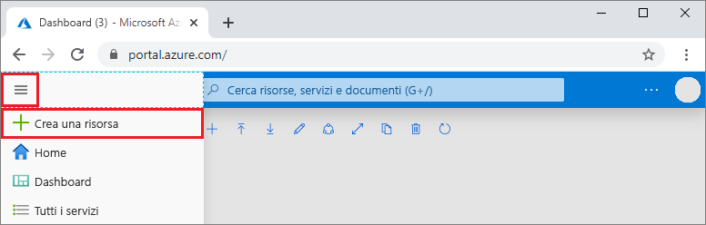
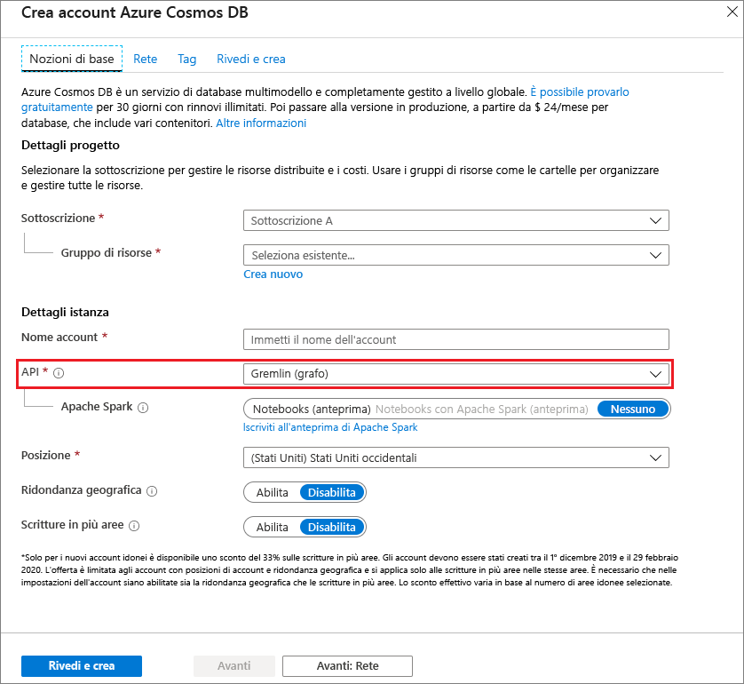
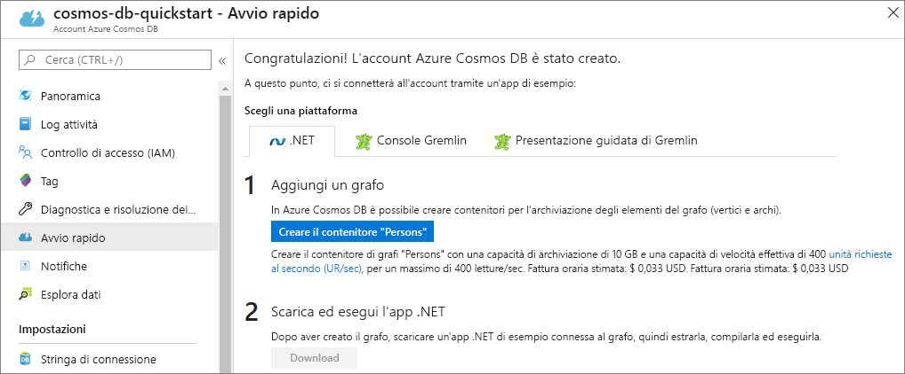

1. In una nuova finestra del browser accedere al [portale di Azure](https://portal.azure.com/).

2. Nel menu a sinistra selezionare **Crea una risorsa**.
   
   
   
3. Nella pagina **Nuovo** selezionare **Database** > **Azure Cosmos DB**.
   
   
   
   > [!TIP]
   > Se Azure Cosmos DB non è visibile nell'elenco, è sufficiente digitarlo nella casella di ricerca nella parte superiore della pagina e quindi premere _Invio_. 

3. Nella pagina **Crea account Azure Cosmos DB** immettere le impostazioni per il nuovo account Azure Cosmos DB. 
 
    Impostazione|Valore|Descrizione
    ---|---|---
    Subscription|Sottoscrizione in uso|Selezionare la sottoscrizione di Azure da usare per l'account Azure Cosmos DB. 
    Gruppo di risorse|Create new  Immettere quindi lo stesso nome specificato nome dell'account.|Selezionare **Crea nuovo**. Immettere quindi il nome di un nuovo gruppo di risorse per l'account. Per semplicità, usare lo stesso nome usato come nome dell'account Azure Cosmos DB. 
    Nome account|Immettere un nome univoco|Immettere un nome univoco per identificare l'account Azure Cosmos DB. L'URI dell'account sarà *gremlin.cosmos.azure.com* e verrà aggiunto al nome dell'account univoco.  Il nome dell'account può contenere solo lettere minuscole, numeri e trattini e deve avere una lunghezza compresa tra 3 e 31 caratteri.
    API|Gremlin (grafo)|L'API determina il tipo di account da creare. Azure Cosmos DB offre cinque API: Core (SQL) per i database di documenti, Gremlin per i database a grafo, MongoDB per i database di documenti, Tabella di Azure e Cassandra. È necessario creare un account separato per ogni API.   Selezionare **Gremlin (grafo)** perché in questa guida di avvio rapido si crea una tabella che funziona con l'API Gremlin.   [Altre informazioni sull'API Gremlin](../articles/cosmos-db/graph-introduction.md).|
    Location|Selezionare l'area più vicina agli utenti|Selezionare una posizione geografica in cui ospitare l'account Azure Cosmos DB. Usare la località più vicina agli utenti per offrire loro la massima velocità di accesso ai dati.

    Selezionare **Rivedi+Crea**. È possibile ignorare le sezioni **Rete** e **Tag**. 

    

4. La creazione dell'account richiede alcuni minuti. Attendere che nel portale venga visualizzata la pagina **Complimenti, l'account Azure Cosmos DB è stato creato**.
   
   

