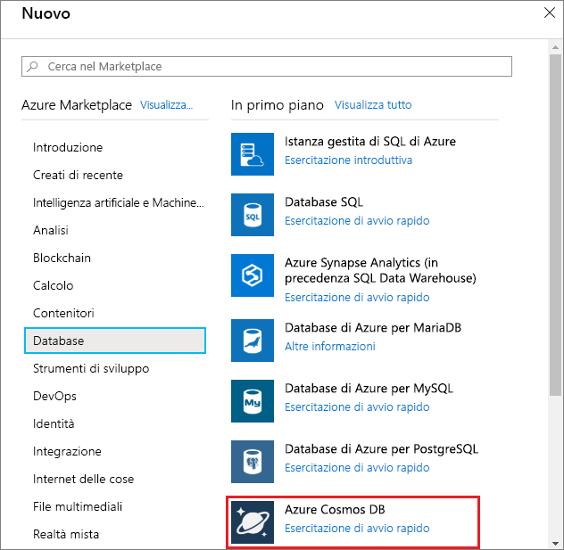
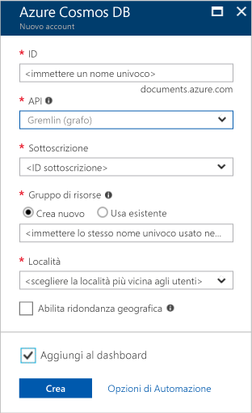

1. In una nuova finestra accedere al [portale di Azure](https://portal.azure.com/).
2. Nel menu a sinistra fare clic su **Nuovo**, scegliere **Database** e quindi **Azure Cosmos DB**.
   
   

3. Nel pannello **Nuovo account** specificare la configurazione desiderata per l'account Azure Cosmos DB. 

    Con Azure Cosmos DB è possibile scegliere uno dei quattro modelli di programmazione: Gremlin (graph), MongoDB, SQL (DocumentDB) e Table (key-value).  
       
    In questa guida introduttiva eseguiremo la programmazione in base all'API Graph, per cui occorrerà scegliere **Gremlin (graph)** nella compilazione del modulo. Tuttavia, se si dispone di dati documento di un'app di catalogo, dati chiave-valore (tabella) o dati migrati da un'app MongoDB, tenere presente che Azure Cosmos DB può fornire una piattaforma di servizi di database distribuiti a livello globale e a disponibilità elevata per tutte le applicazioni cruciali.

    Compilare il pannello Nuovo account usando le informazioni riportate nello screenshot come guida. Scegliere valori univoci per l'impostazione del proprio account in modo che i valori immessi non corrispondano esattamente a quelli dello screenshot. 
 
    

    Impostazione|Valore consigliato|Descrizione
    ---|---|---
    ID|*Valore univoco*|Nome univoco scelto per identificare l'account Azure Cosmos DB. Poiché alI'ID fornito viene aggiunto *documents.azure.com* per creare l'URI, usare un ID univoco ma facilmente identificabile. L'ID può contenere solo lettere minuscole, numeri e il carattere '-' e deve avere una lunghezza compresa tra 3 e 50 caratteri.
    API|Gremlin (graph)|Eseguiremo la programmazione in base all'[API Graph](../articles/cosmos-db/graph-introduction.md) più avanti in questo articolo.|
    Sottoscrizione|*Sottoscrizione in uso*|Sottoscrizione di Azure da usare per l'account Azure Cosmos DB. 
    Gruppo di risorse|*Stesso valore di ID*|Nome del nuovo gruppo di risorse per l'account. Per semplicità si può usare lo stesso nome usato come ID. 
    Località|*Area più vicina ai propri utenti*|Posizione geografica in cui ospitare l'account Azure Cosmos DB. Scegliere la posizione più vicina ai propri utenti per fornire loro l'accesso più rapido possibile ai dati.

4. Fare clic su **Crea** per creare l'account.
5. Sulla barra degli strumenti fare clic su **Notifiche** per monitorare il processo di distribuzione.

    

6.  Al termine della distribuzione aprire il nuovo account dal riquadro Tutte le risorse. 

    