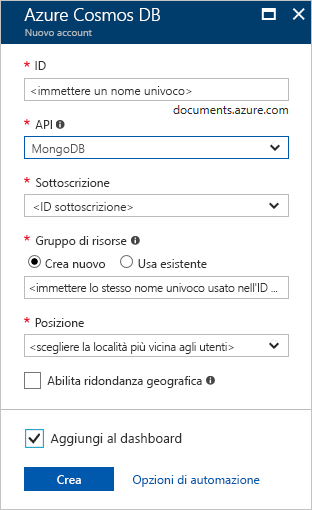
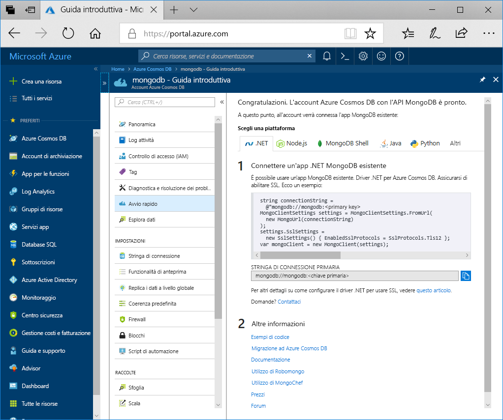

1. In una nuova finestra accedere al [portale di Azure](https://portal.azure.com/).
2. Nel menu a sinistra fare clic su **Crea una risorsa**, quindi su **Database** e infine in **Azure Cosmos DB** fare clic su **Crea**.
   
   

3. Nel pannello **Nuovo account** specificare **MongoDB** per l'API e immettere le informazioni relative alla configurazione desiderata per l'account Azure Cosmos DB.
 
    * **ID** deve essere un nome univoco da usare per identificare l'account Azure Cosmos DB. Può contenere solo lettere minuscole, numeri, il carattere "-" e deve essere compreso fra 3 e 50 caratteri.
    * **Sottoscrizione** è la sottoscrizione di Azure e viene compilata automaticamente.
    * **Gruppo di risorse** è il nome del gruppo di risorse per l'account Azure Cosmos DB. Selezionare **Crea nuovo**, quindi immettere il nome di un nuovo gruppo di risorse per l'account. Per semplicità si può usare lo stesso nome usato come ID.
    * **Percorso** è la posizione geografica in cui si trova l'istanza di Azure Cosmos DB. Scegliere la località più vicina agli utenti.

    Fare quindi clic su **Crea**.

    

4. La creazione dell'account richiede alcuni minuti, Attendere che nel portale venga visualizzata la pagina **Complimenti, L'account Azure Cosmos DB con l'API MongoDB è pronto.**

    
