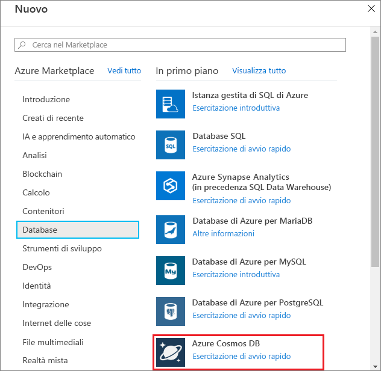
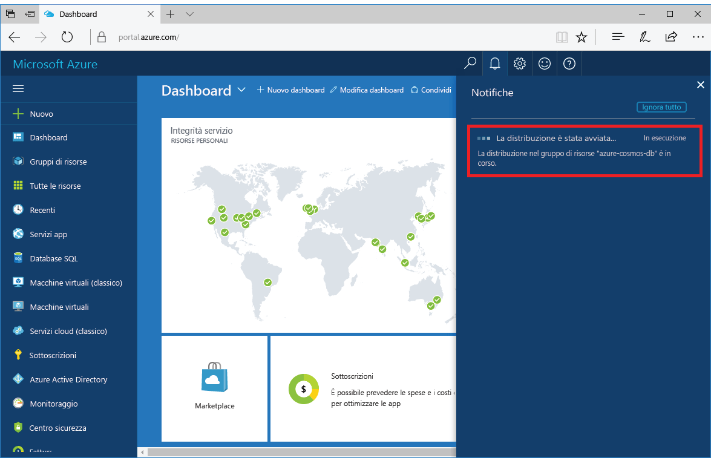
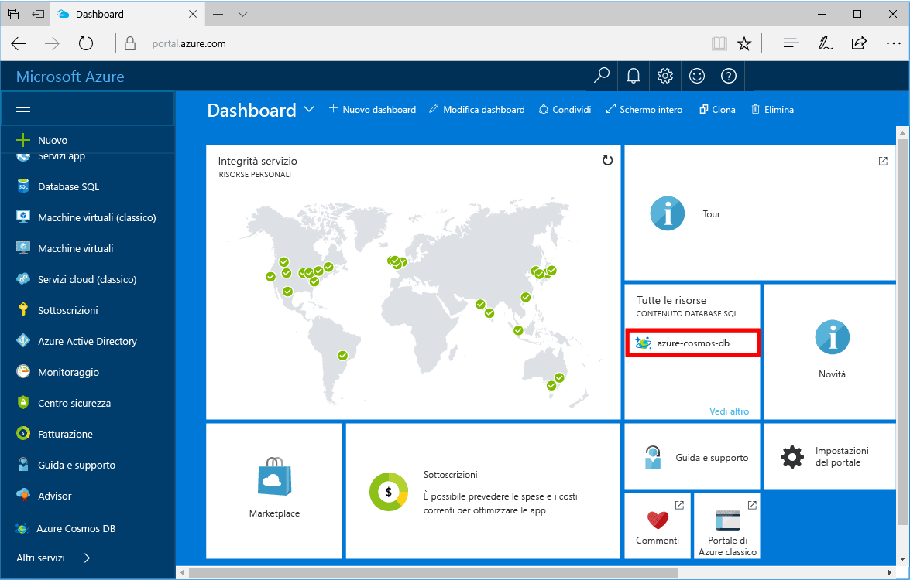

1. In una nuova finestra accedere al [portale di Azure](https://portal.azure.com/).
2. Nel menu a sinistra fare clic su **Crea una risorsa**, quindi su **Database** e infine in **Azure Cosmos DB** fare clic su **Crea**.
   
   

3. Nel riquadro **Nuovo account** specificare la configurazione desiderata per l'account Azure Cosmos DB. 

    Con Azure Cosmos DB è possibile scegliere uno dei quattro modelli di programmazione: Gremlin (grafo), MongoDB, Cassandra, SQL e Tabella di Azure. 
       
    In questa guida introduttiva eseguiremo la programmazione in base all'API MongoDB, per cui occorrerà scegliere **MongoDB** nella compilazione del modulo. Tuttavia, se si dispone di dati grafo per un'app social media, dati documento di un'app di catalogo o dati chiave-valore (tabella), tenere presente che Azure Cosmos DB può fornire una piattaforma di servizi di database distribuiti a livello globale e a disponibilità elevata per tutte le applicazioni cruciali.

    Compilare il riquadro **Nuovo account** usando le informazioni riportate nella tabella come guida.
 
    
   
    Impostazione|Valore consigliato|DESCRIZIONE
    ---|---|---
    ID|*Valore univoco*|Nome univoco scelto per identificare l'account Azure Cosmos DB. Poiché alI'ID fornito viene aggiunto *documents.azure.com* per creare l'URI, usare un ID univoco ma facilmente identificabile. L'ID può contenere solo lettere minuscole, numeri e il carattere '-' e deve avere una lunghezza compresa tra 3 e 50 caratteri.
    API|MongoDB|L'API determina il tipo di account da creare. Azure Cosmos DB offre cinque API per soddisfare le esigenze dell'applicazione, ovvero SQL (database di documenti) Gremlin (grafo), MongoDB, Tabella di Azure e Cassandra, per ognuna delle quali è attualmente necessario un account separato.   Selezionare **MongoDB** perché in questa guida introduttiva si crea un database di documenti su cui è possibile eseguire query usando MongoDB.  [Altre informazioni sull'API MongoDB](../articles/cosmos-db/mongodb-introduction.md)|
    Sottoscrizione|*Sottoscrizione in uso*|Sottoscrizione di Azure da usare per l'account Azure Cosmos DB. 
    Gruppo di risorse|*Stesso valore di ID*|Nome del nuovo gruppo di risorse per l'account. Per semplicità si può usare lo stesso nome usato come ID. 
    Località|*Area più vicina ai propri utenti*|Posizione geografica in cui ospitare l'account Azure Cosmos DB. Scegliere la posizione più vicina ai propri utenti per fornire loro l'accesso più rapido possibile ai dati.

4. Fare clic su **Crea** per creare l'account.
5. Sulla barra degli strumenti fare clic su **Notifiche** per monitorare il processo di distribuzione.

    

6. Al termine della distribuzione aprire il nuovo account dal riquadro Tutte le risorse. 

    
