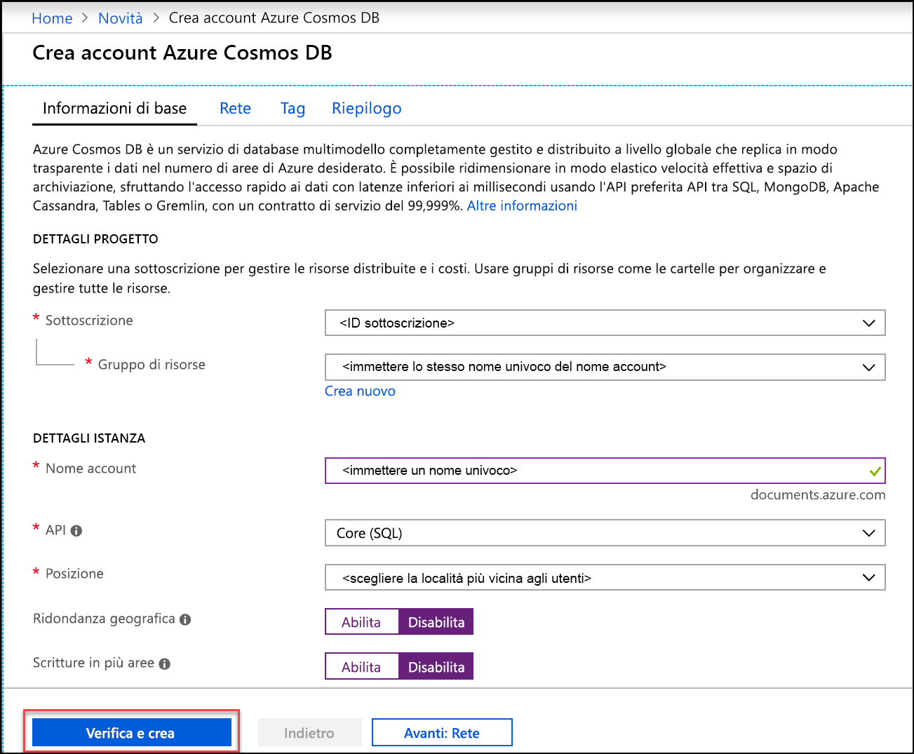
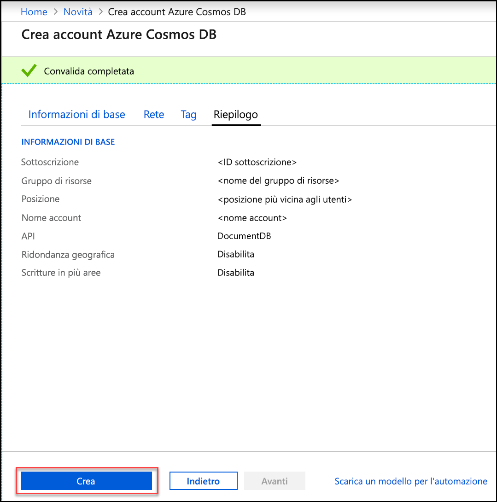
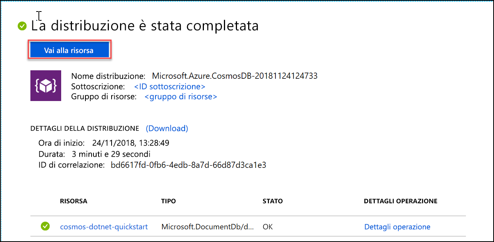

1. In una nuova finestra del browser accedere al [portale di Azure](https://portal.azure.com/).
2. Fare clic su **Crea una risorsa** > **Database** > **Azure Cosmos DB**.
   
   

3. Nella pagina **Crea account Cosmos DB** immettere le impostazioni per il nuovo account Azure Cosmos DB. 
 
    Impostazione|Valore|DESCRIZIONE
    ---|---|---
    Sottoscrizione|*Sottoscrizione in uso*|Selezionare la sottoscrizione di Azure da usare per l'account Azure Cosmos DB. 
    Gruppo di risorse|Creare un nuovo gruppo di risorse  *Immettere un nome univoco*|Selezionare **Crea nuovo**, quindi immettere il nome di un nuovo gruppo di risorse per l'account. Per semplicità si può usare lo stesso nome usato come nome account. 
    Nome account|*Immettere un nome univoco*|Immettere un nome univoco per identificare l'account Azure Cosmos DB. Poiché all'ID fornito viene aggiunto *documents.azure.com* per creare l'URI, usare un ID univoco.  L'ID può contenere solo lettere minuscole, numeri e il segno meno (-) e deve avere una lunghezza compresa tra 3 e 31 caratteri.
    API|Core (SQL)|L'API determina il tipo di account da creare. Azure Cosmos DB offre cinque API: SQL (database di documenti) Gremlin (database di grafi), MongoDB (database di documenti), API Tabella e API Cassandra. Per ognuna di queste è attualmente necessario un account separato.   Selezionare **Core (SQL)** poiché in questo articolo si creeranno un database di documenti e una query usando la sintassi SQL.   [Altre informazioni sull'API SQL](../articles/cosmos-db/documentdb-introduction.md)|
    Località|*Selezionare l'area più vicina agli utenti*|Selezionare una posizione geografica in cui ospitare l'account Azure Cosmos DB. Usare la località più vicina agli utenti per offrire loro la massima velocità di accesso ai dati.
    Abilita ridondanza geografica| Lasciare vuoto | Consente di creare una versione replicata del database in una seconda area abbinata. Lasciare vuoto.  
    Multi-region writes (Scritture in più aree)| Lasciare vuoto | Consente di impostare ognuna delle aree del database come area sia di lettura che di scrittura. Lasciare vuoto.  

    Quindi fare clic su **Rivedi e crea**. È possibile ignorare le sezioni **Rete** e **Tag**. 

    

    Esaminare le informazioni di riepilogo e fare clic su **Crea**. 

    

4. La creazione dell'account richiede alcuni minuti, Attendere che il portale visualizzi il messaggio **La distribuzione è stata completata** e fare clic su **Vai alla risorsa**.     

    

5. Nel portale verrà visualizzata la pagina  **l'account Azure Cosmos DB è stato creato**.

    

