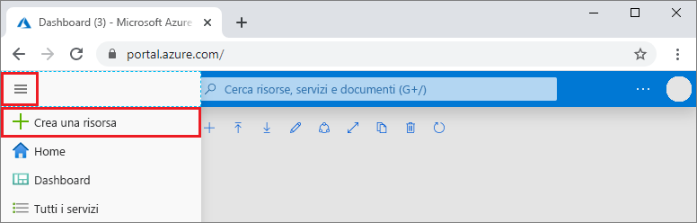

1. In una nuova finestra del browser accedere al [portale di Azure](https://portal.azure.com/).

2. Nel menu a sinistra selezionare **Crea una risorsa**.
   
   
   
3. Nella pagina **Nuovo** selezionare **Database** > **Azure Cosmos DB**.
   
   
   
3. Nella pagina **Crea account Azure Cosmos DB** immettere le impostazioni per il nuovo account Azure Cosmos DB. 
 
    Impostazione|valore|Descrizione
    ---|---|---
    Subscription|Sottoscrizione in uso|Selezionare la sottoscrizione di Azure da usare per l'account Azure Cosmos DB. 
    Gruppo di risorse|**Crea nuovo**, quindi Nome account|Selezionare **Crea nuovo**. Immettere quindi il nome di un nuovo gruppo di risorse per l'account. Per semplicità, usare lo stesso nome usato come nome dell'account Azure Cosmos DB. 
    Nome account|Un nome univoco|Immettere un nome univoco per identificare l'account Azure Cosmos DB.  Il nome dell'account può contenere solo lettere minuscole, numeri e trattini e deve avere una lunghezza compresa tra 3 e 31 caratteri.
    API|Tabella|L'API determina il tipo di account da creare. Azure Cosmos DB offre cinque API: Core (SQL) per i database di documenti, Gremlin per i database a grafo, MongoDB per i database di documenti, Tabella di Azure e Cassandra. È necessario creare un account separato per ogni API.   Selezionare **Tabella di Azure** perché in questa guida di avvio rapido si creerà una tabella che funziona con l'API Tabella.   [Altre informazioni sull'API Tabella](../articles/cosmos-db/table-introduction.md).|
    Location|Area più vicina ai propri utenti|Selezionare una posizione geografica in cui ospitare l'account Azure Cosmos DB. Usare la località più vicina agli utenti per offrire loro la massima velocità di accesso ai dati.

    È possibile lasciare il valore predefinito **Disabilita** per le opzioni **Ridondanza geografica** e **Scritture in più aree** per evitare ulteriori addebiti e ignorare le sezioni relative a **Rete** e **Tag**.

5. Selezionare **Rivedi+Crea**. Dopo aver completato la convalida, selezionare **Crea** per creare l'account. 
 
   

6. La creazione dell'account richiede alcuni minuti. Verrà visualizzato il messaggio **La distribuzione è in corso**. Attendere il completamento della distribuzione e quindi selezionare **Vai alla risorsa**.

    

