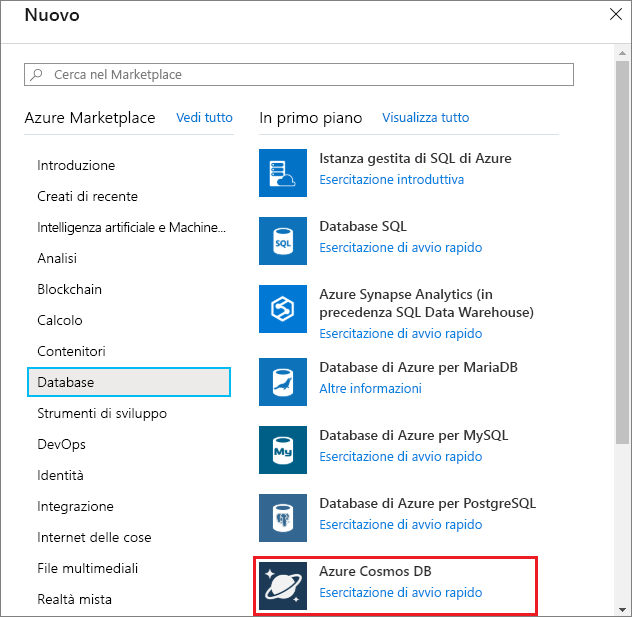
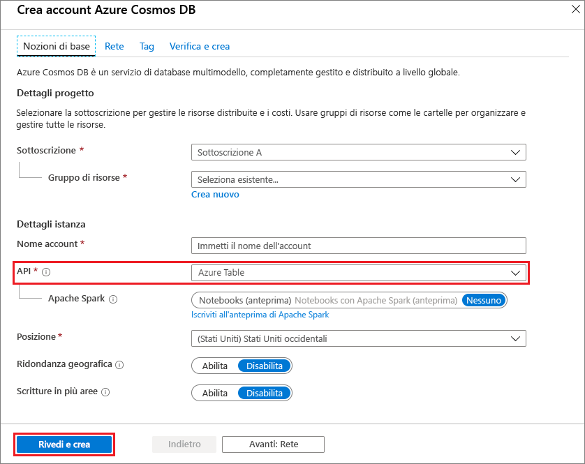
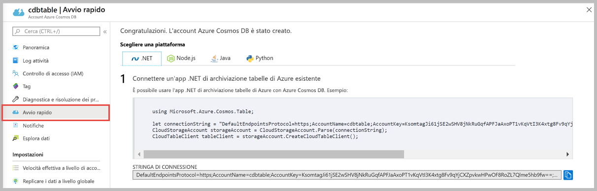

1. In una nuova finestra del browser accedere al [portale di Azure](https://portal.azure.com/).
2. Nel riquadro di spostamento sinistro selezionare **Crea una risorsa**. Selezionare **Database** e quindi **Azure Cosmos DB**.
   
   

3. Nella pagina **Crea account Azure Cosmos DB** immettere le impostazioni per il nuovo account Azure Cosmos DB:
 
    Impostazione|Valore|DESCRIZIONE
    ---|---|---
    Sottoscrizione|Sottoscrizione in uso|Selezionare la sottoscrizione di Azure da usare per l'account Azure Cosmos DB. 
    Gruppo di risorse|Creare un nuovo gruppo di risorse  Immettere quindi lo stesso nome univoco specificato in ID|Selezionare **Crea nuovo**. Immettere quindi il nome di un nuovo gruppo di risorse per l'account. Per semplicità, usare lo stesso nome usato come ID. 
    Nome account|Immettere un nome univoco|Immettere un nome univoco per identificare l'account Azure Cosmos DB.  L'ID può contenere solo lettere minuscole, numeri e il carattere trattino (-). Deve essere composto da un numero di caratteri compreso tra 3 e 31.
    API|tabella di Azure|L'API determina il tipo di account da creare. Azure Cosmos DB offre cinque API: Core (SQL) per i database di documenti, Gremlin per i database a grafo, MongoDB per i database di documenti, Tabella di Azure e Cassandra. Attualmente, è necessario creare un account separato per ogni API.   Selezionare **Tabella di Azure** perché in questo argomento di avvio rapido si crea una tabella che funziona con l'API Tabella.   [Altre informazioni sull'API Tabella](../articles/cosmos-db/table-introduction.md).|
    Località|Selezionare l'area più vicina agli utenti|Selezionare una posizione geografica in cui ospitare l'account Azure Cosmos DB. Usare la località più vicina agli utenti per offrire loro la massima velocità di accesso ai dati.

    È possibile lasciare i valori predefiniti **(Disabilita)** per le opzioni **Ridondanza geografica** e **Scritture in più aree** per evitare ulteriori addebiti di UR. È possibile ignorare le sezioni **Rete** e **Tag**.

5. Selezionare **Rivedi+Crea**. Dopo aver completato la convalida, selezionare **Crea** per creare l'account. 
 
   

6. La creazione dell'account richiede alcuni minuti. Verrà visualizzato il messaggio **La distribuzione è in corso**. Attendere il completamento della distribuzione e quindi selezionare **Vai alla risorsa**.

    
