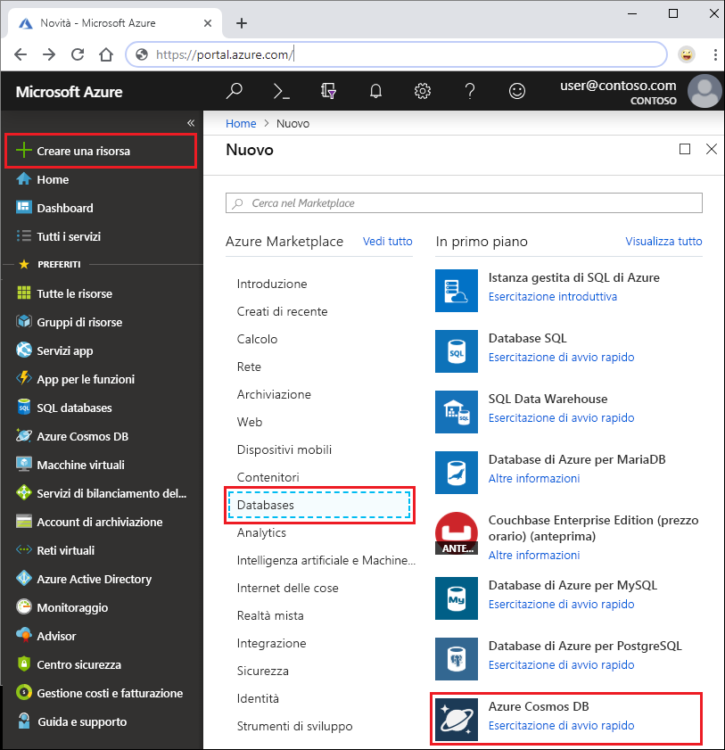
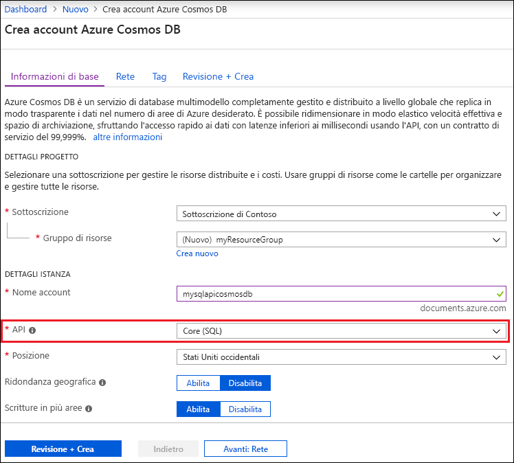
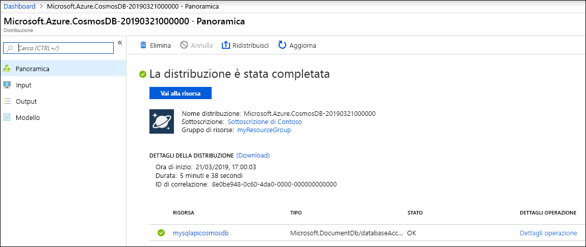

1. In una nuova finestra del browser accedere al [portale di Azure](https://portal.azure.com/).
2. Selezionare **Crea una risorsa** > **Database** > **Azure Cosmos DB**.
   
   

3. Nella pagina **Crea account Cosmos DB** immettere le impostazioni base per il nuovo account Azure Cosmos DB. 
 
    Impostazione|Valore|DESCRIZIONE
    ---|---|---
    Sottoscrizione|Sottoscrizione in uso|Selezionare la sottoscrizione di Azure da usare per l'account Azure Cosmos DB. 
    Gruppo di risorse|Creare un nuovo gruppo di risorse  Immettere quindi lo stesso nome univoco specificato in ID|Selezionare **Crea nuovo**. Immettere quindi il nome di un nuovo gruppo di risorse per l'account. Per semplicità, usare lo stesso nome usato come ID. 
    Nome account|Immettere un nome univoco|Immettere un nome univoco per identificare l'account Azure Cosmos DB. Poiché all'ID fornito viene aggiunto *documents.azure.com* per creare l'URI, usare un ID univoco.  L'ID può contenere solo lettere minuscole, numeri e il carattere trattino (-). Deve avere una lunghezza compresa tra 3 e 31 caratteri. 
    API|Core(SQL)|L'API determina il tipo di account da creare. Azure Cosmos DB offre cinque API: Core (SQL) per i database di documenti, Gremlin per i database a grafo, MongoDB per i database di documenti, Tabella di Azure e Cassandra. Attualmente, è necessario creare un account separato per ogni API.   Selezionare **Core(SQL)** poiché in questo articolo si creano un database di documenti e una query usando la sintassi SQL.   [Altre informazioni sull'API SQL](../articles/cosmos-db/documentdb-introduction.md).|
    Località|Selezionare l'area più vicina agli utenti|Selezionare una posizione geografica in cui ospitare l'account Azure Cosmos DB. Usare la località più vicina agli utenti per offrire loro la massima velocità di accesso ai dati.

    Selezionare **Rivedi+Crea**. È possibile ignorare le sezioni **Rete** e **Tag**. 

    

4. La creazione dell'account richiede alcuni minuti, Attendere che nel portale venga visualizzata la pagina **Complimenti, l'account Azure Cosmos DB è stato creato**.

    

