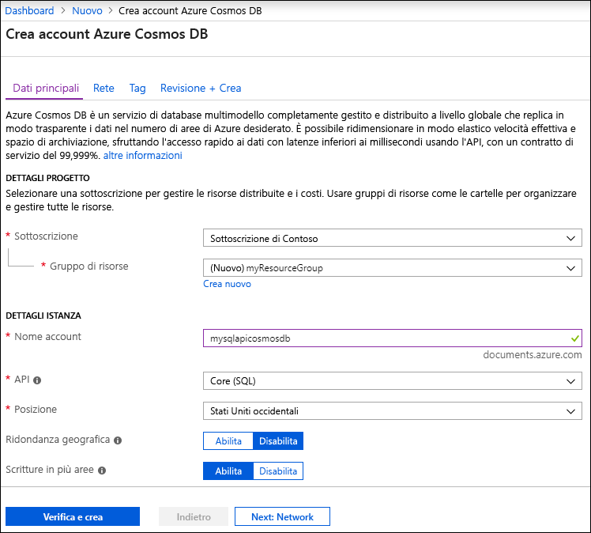
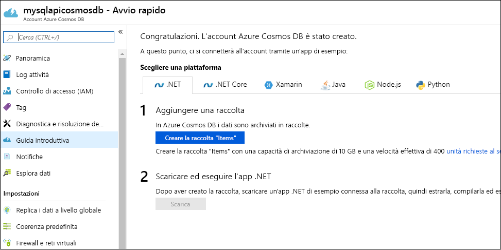

1. Passare al [portale di Azure](https://portal.azure.com/) per creare un account Azure Cosmos DB. Cercare e selezionare **Azure Cosmos DB**.

   

1. Selezionare **Aggiungi**.
1. Nella pagina **Crea account Cosmos DB** immettere le impostazioni base per il nuovo account Azure Cosmos. 

    |Impostazione|Valore|DESCRIZIONE |
    |---|---|---|
    |Subscription|Nome della sottoscrizione|Selezionare la sottoscrizione di Azure da usare per l'account Azure Cosmos. |
    |Gruppo di risorse|Nome del gruppo di risorse|Selezionare un gruppo di risorse oppure fare clic su **Crea nuovo**, quindi immettere un nome univoco per il nuovo gruppo di risorse. |
    |Nome account|Un nome univoco|Immettere un nome per identificare l'account Azure Cosmos. Poiché all'ID fornito viene aggiunto *documents.azure.com* per creare l'URI, usare un ID univoco.  L'ID può contenere solo lettere minuscole, numeri e il carattere trattino (-). Deve avere una lunghezza compresa tra 3 e 31 caratteri.|
    |API|Il tipo di account da creare|Selezionare **Core (SQL)** per creare un database di documenti e una query con la sintassi SQL.   L'API determina il tipo di account da creare. Azure Cosmos DB offre cinque API: Core (SQL) e MongoDB per dati dei documenti, Gremlin per i dati dei grafici, Tabelle di Azure e Cassandra. Attualmente, è necessario creare un account separato per ogni API.   [Altre informazioni sull'API SQL](../articles/cosmos-db/documentdb-introduction.md).|
    |Location|Area più vicina ai propri utenti|Selezionare una posizione geografica in cui ospitare l'account Azure Cosmos DB. Usare la località più vicina agli utenti per offrire loro la massima velocità di accesso ai dati.|

   

1. Selezionare **Rivedi e crea**. È possibile ignorare le sezioni **Rete** e **Tag**.

1. Esaminare le impostazioni dell'account e quindi selezionare **Crea**. La creazione dell'account richiede alcuni minuti. Attendere che la pagina del portale visualizzi **La distribuzione è stata completata**. 

    

1. Selezionare **Vai alla risorsa** per passare alla pagina dell'account Azure Cosmos DB. 

    
