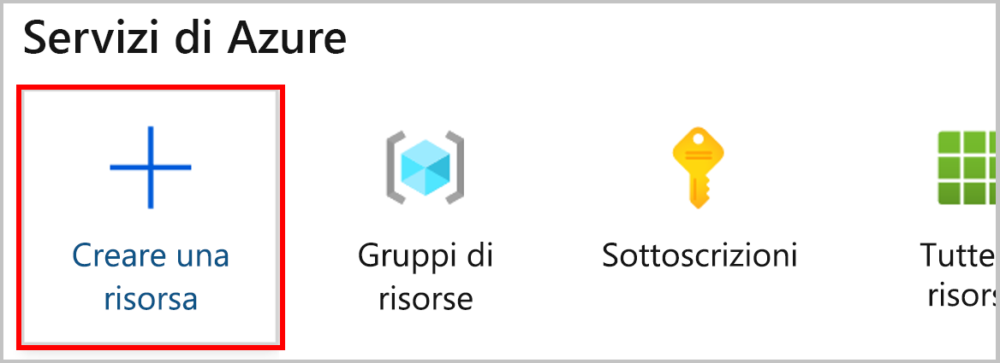
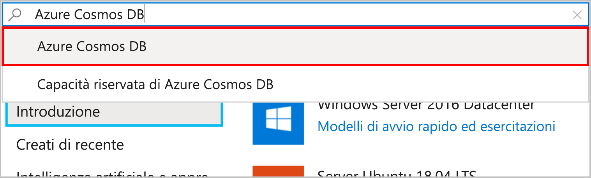
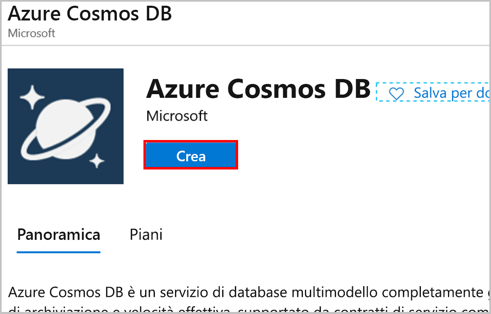
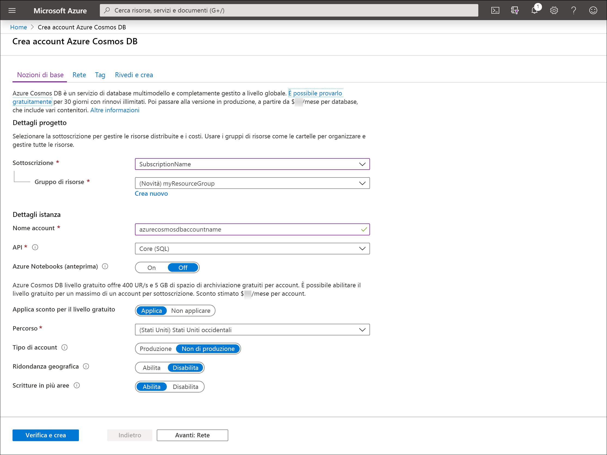

1. Passare al [portale di Azure](https://portal.azure.com/) per creare un account Azure Cosmos DB. Nella Home page scegliere **Crea una risorsa** dal pannello **Servizi di Azure**.

   

1. Cercare e selezionare **Azure Cosmos DB**.

   

1. Selezionare **Create** (Crea).

   

1. Nella pagina **Crea account Cosmos DB** immettere le impostazioni base per il nuovo account Azure Cosmos. 

    |Impostazione|valore|Descrizione |
    |---|---|---|
    |Subscription|Nome sottoscrizione|Selezionare la sottoscrizione di Azure da usare per l'account Azure Cosmos. |
    |Gruppo di risorse|Nome del gruppo di risorse|Selezionare un gruppo di risorse oppure fare clic su **Crea nuovo**, quindi immettere un nome univoco per il nuovo gruppo di risorse. |
    |Nome account|Un nome univoco|Immettere un nome per identificare l'account Azure Cosmos. Dato che al nome specificato viene aggiunto *documents.azure.com* per creare l'URI, usare un nome univoco.  Il nome può contenere solo lettere minuscole, numeri e il segno meno (-). Deve avere una lunghezza compresa tra 3 e 31 caratteri.|
    |API|Il tipo di account da creare|Selezionare **Core (SQL)** per creare un database di documenti e una query con la sintassi SQL.   L'API determina il tipo di account da creare. Azure Cosmos DB offre cinque API: Core (SQL) e MongoDB per dati dei documenti, Gremlin per i dati dei grafici, Tabelle di Azure e Cassandra. Attualmente, è necessario creare un account separato per ogni API.   [Altre informazioni sull'API SQL](../articles/cosmos-db/documentdb-introduction.md).|
    |Applica sconto per il livello gratuito|Applica o Non applicare|Azure Cosmos DB livello gratuito offre i primi 400 UR/s e 5 GB di spazio di archiviazione gratuiti per account. Altre informazioni sul [livello gratuito](https://azure.microsoft.com/pricing/details/cosmos-db/).|
    |Location|Area più vicina ai propri utenti|Selezionare una posizione geografica in cui ospitare l'account Azure Cosmos DB. Usare la località più vicina agli utenti per offrire loro la massima velocità di accesso ai dati.|
    |Tipo di account|Produzione o Non di produzione|Selezionare **Produzione** se l'account verrà usato per un carico di lavoro di produzione. Selezionare **Non di produzione** se l'account non verrà usato per un carico di lavoro di produzione, ad esempio per lo sviluppo, il test, il controllo di qualità o lo staging. Si tratta di un'impostazione di tag delle risorse di Azure che consente di ottimizzare l'esperienza del portale, ma non influisce sull'account Azure Cosmos DB sottostante. È possibile modificare questo valore in qualsiasi momento.|

    > [!NOTE]
    > È possibile avere fino a un account Azure Cosmos DB del livello gratuito per ogni sottoscrizione di Azure ed è necessario acconsentire esplicitamente durante la creazione dell'account. Se l'opzione per l'applicazione dello sconto per il livello gratuito non è visualizzata, un altro account nella sottoscrizione è già stato abilitato per il livello gratuito.
   
   

1. Selezionare **Rivedi e crea**. È possibile ignorare le sezioni **Rete** e **Tag**.

1. Esaminare le impostazioni dell'account e quindi selezionare **Crea**. La creazione dell'account richiede alcuni minuti. Attendere che la pagina del portale visualizzi **La distribuzione è stata completata**. 

    

1. Selezionare **Vai alla risorsa** per passare alla pagina dell'account Azure Cosmos DB. 

    
