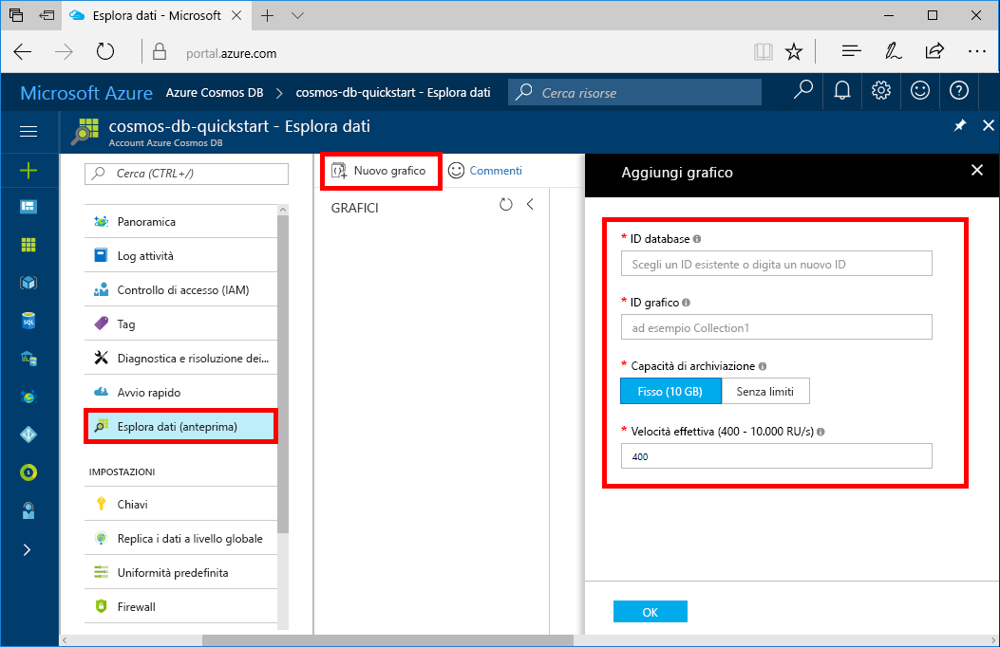

È ora possibile usare lo strumento Esplora dati nel portale di Azure per creare un database a grafo. 

1. Dal menu a sinistra del portale di Azure scegliere **Esplora dati (anteprima)**.

2. In **Esplora dati (anteprima)** selezionare **New Graph** (Nuovo grafo). Compilare quindi la pagina usando le informazioni seguenti:

    

    Impostazione|Valore consigliato|Descrizione
    ---|---|---
    ID database|sample-database|ID del nuovo database. I nomi dei database devono avere una lunghezza compresa tra 1 e 255 caratteri e non possono contenere `/ \ # ?` o spazi finali.
    Graph id (ID grafo)|sample-graph|ID del nuovo grafo. I nomi dei grafi presentano gli stessi requisiti relativi ai caratteri degli ID di database.
    Capacità di archiviazione| 10 GB|Lasciare il valore predefinito. Indica la capacità di archiviazione del database.
    Velocità effettiva|400 UR/s|Lasciare il valore predefinito. È possibile aumentare la velocità effettiva in un secondo momento se si desidera ridurre la latenza.
    Chiave di partizione|/firstName|Chiave di partizione che distribuisce i dati in modo uniforme a ogni partizione. Quando si crea un grafo ad alte prestazioni, è importante selezionare la chiave di partizione corretta. Per altre informazioni, vedere [Progettazione per il partizionamento](../articles/cosmos-db/partition-data.md#designing-for-partitioning).

3. Dopo avere compilato il modulo, fare clic su **OK**.
