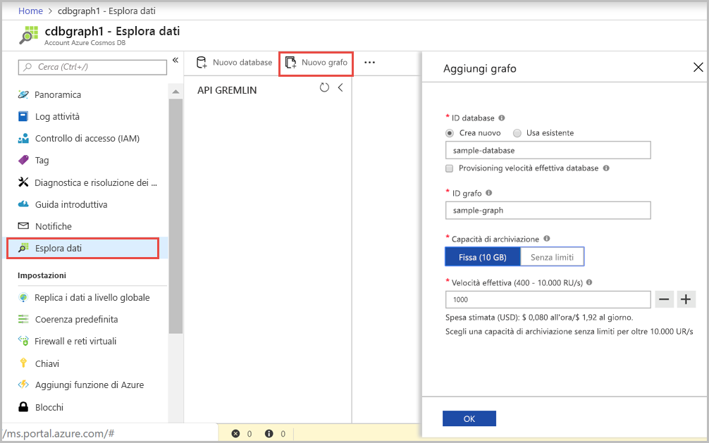

È ora possibile usare lo strumento Esplora dati nel portale di Azure per creare un database a grafo. 

1. Fare clic su **Esplora dati** > **New Graph** (Nuovo grafo).

    Viene visualizzata l'area **Add Graph** (Aggiungi grafo) all'estrema destra. Per vederla potrebbe essere necessario scorrere la schermata.

    

2. Nella pagina **Add Graph** (Aggiungi grafo) immettere le impostazioni per il nuovo grafo.

    Impostazione|Valore consigliato|DESCRIZIONE
    ---|---|---
    ID database|sample-database|Immettere *sample-database* come nome del nuovo database. I nomi dei database devono avere una lunghezza compresa tra 1 e 255 caratteri e non possono contenere `/ \ # ?` o spazi finali.
    ID grafo|sample-graph|Immettere *sample-graph* come nome della nuova raccolta. I nomi dei grafi presentano gli stessi requisiti relativi ai caratteri degli ID di database.
    Capacità di archiviazione|Fissa (10 GB)|Lasciare il valore predefinito **Fissa (10 GB)** . Questo valore indica la capacità di archiviazione del database.
    Velocità effettiva|400 UR/s|Modificare la velocità effettiva in 400 unità richiesta al secondo (UR/sec). Se si vuole ridurre la latenza, è possibile aumentare la velocità effettiva in un secondo momento.

3. Dopo aver compilato il modulo, fare clic su **OK**.
