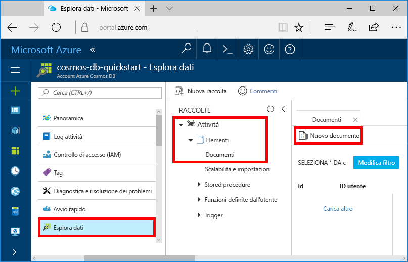
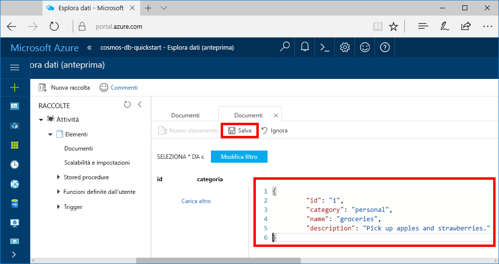

È ora possibile aggiungere dati alla nuova raccolta usando Esplora dati.

1. In Esplora dati il nuovo database viene visualizzato nel riquadro Raccolte. Espandere il database **Tasks**, espandere la raccolta **Items**, fare clic su **Documenti** e quindi su **Nuovo documento**. 

   
  
2. Aggiungere ora un documento alla raccolta con la struttura seguente.

     ```json
     {
         "id": "1",
         "category": "personal",
         "name": "groceries",
         "description": "Pick up apples and strawberries.",
         "isComplete": false
     }
     ```

3. Dopo avere aggiunto il codice JSON alla scheda **Documenti**, fare clic su **Salva**.

    

4.  Creare e salvare un altro documento inserendo un valore univoco per la proprietà `id` e modificando le altre proprietà come si preferisce. I nuovi documenti possono avere la struttura desiderata, perché Azure Cosmos DB non impone alcuno schema per i dati.