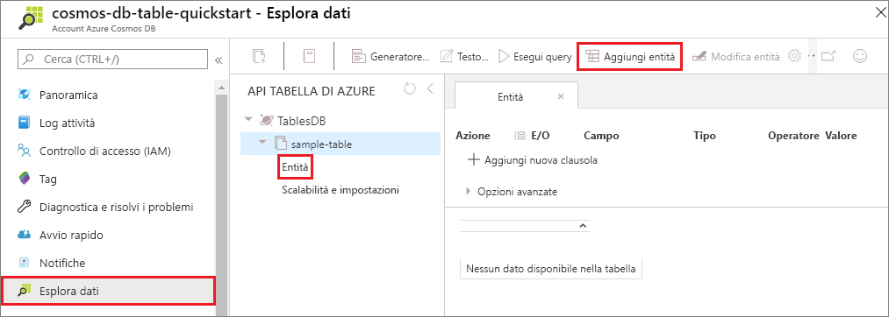
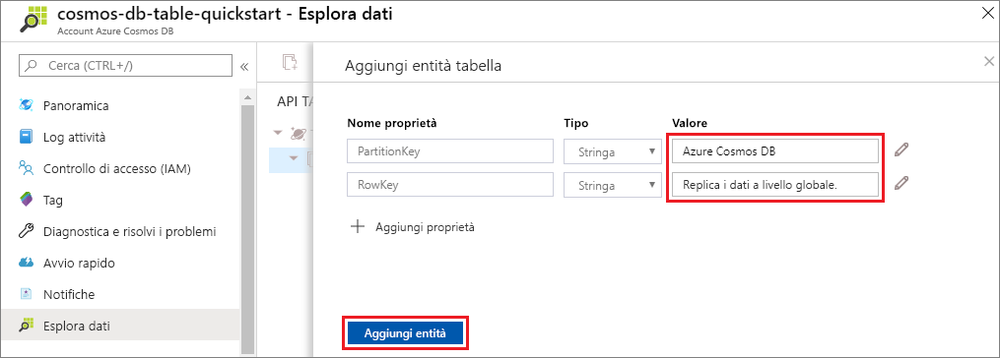

È ora possibile aggiungere dati alla nuova tabella usando Esplora dati.

1. In Esplora dati espandere **sample-table**, fare clic su **Entità** e quindi su **Aggiungi entità**.

   
2. Aggiungere ora i dati alle caselle dei valori di PartitionKey e RowKey e quindi fare clic su **Aggiunti entità**.

   
  
    È ora possibile aggiungere altre entità alla tabella, modificare le entità o eseguire query sui dati in Esplora dati. Esplora dati è anche lo strumento in cui è possibile ridimensionare la velocità effettiva e aggiungere stored procedure, funzioni definite dall'utente e trigger alla tabella.