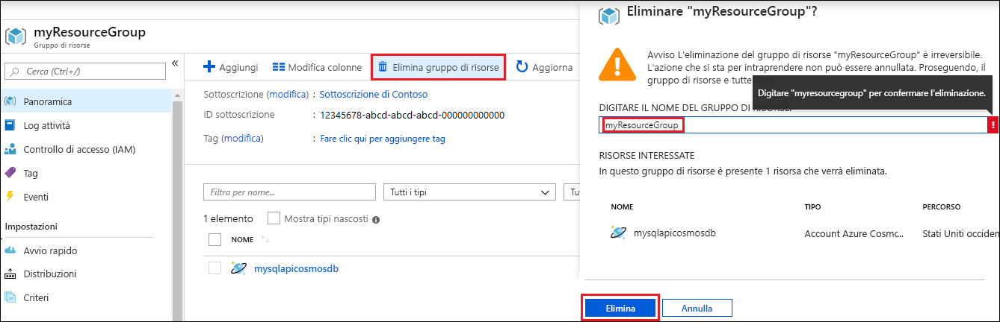

Se non si intende continuare a usare l'app, eliminare tutte le risorse create tramite questa guida di avvio rapido eseguendo i passaggi seguenti, per evitare qualsiasi addebito:

1. Selezionare **Gruppi di risorse** e fare clic su **Elimina gruppo di risorse**. 

   

2. Digitare il nome del gruppo di risorse da eliminare e fare clic su **Elimina**.

