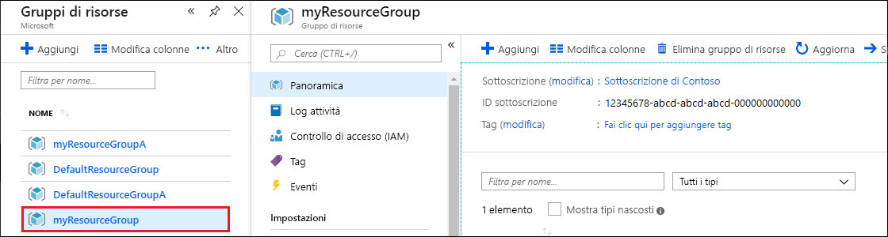

Dopo aver completato le operazioni con l'app Web e l'account Azure Cosmos DB, è possibile eliminare le risorse di Azure create in modo da non incorrere in altri costi. Per eliminare le risorse:

1. Nel portale di Azure fare clic su **Gruppi di risorse** all'estrema sinistra. Se il menu sinistro è compresso, selezionare il  per espanderlo.

2. Selezionare il gruppo di risorse creato in questa guida di avvio rapido.  

   

2. Nella nuova finestra selezionare **Elimina gruppo di risorse**.

      

3. Nella finestra successiva digitare il nome del gruppo di risorse da eliminare e quindi selezionare **Elimina**.

