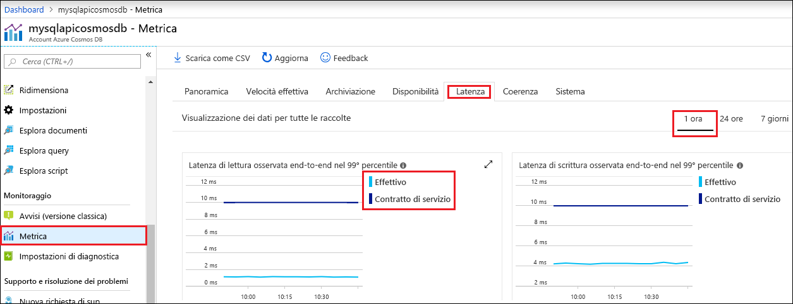

Il portale di Azure consente di monitorare la velocità effettiva, lo spazio di archiviazione, la disponibilità, la latenza e la coerenza dell'account Cosmos DB. I grafici per le metriche associate a un [contratto di servizio di Azure Cosmos DB](https://azure.microsoft.com/support/legal/sla/cosmos-db/) indicano il valore previsto dal contratto di servizio rispetto alle prestazioni effettive. Questo gruppo di metriche garantisce la trasparenza nel monitoraggio dei contratti di servizio.

Per esaminare le metriche e i contratti di servizio: 

1. Selezionare **Metriche** nel menu di spostamento dell'account Cosmos DB.
   
2. Selezionare una scheda, ad esempio **Latenza**, e quindi un intervallo di tempo sulla destra. Confrontare le righe relative ai valori **effettivi** e ai valori del **contratto di servizio** nei grafici.
   
   
   
3. Esaminare le metriche nelle altre schede. 

