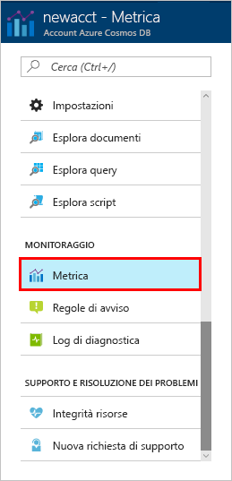
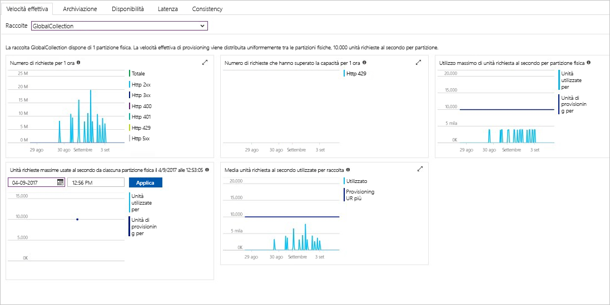

La velocità effettiva, lo spazio di archiviazione, la disponibilità, la latenza e la coerenza delle risorse nell'account vengono monitorati nel portale di Azure. Di seguito vengono illustrate brevemente queste metriche. 

1. Fare clic su **Metriche** nel menu di spostamento.

   

2. Fare clic su ogni scheda per conoscere le metriche offerte da Azure Cosmos DB. 

    Ogni grafico associato ai [contratti di servizio per Azure Cosmos DB](https://azure.microsoft.com/support/legal/sla/cosmos-db/) contiene una linea che indica le eventuali violazioni dei contratti di servizio. Con questo gruppo di metriche, Azure Cosmos DB garantisce trasparenza nel monitoraggio dei contratti di servizio. 

   