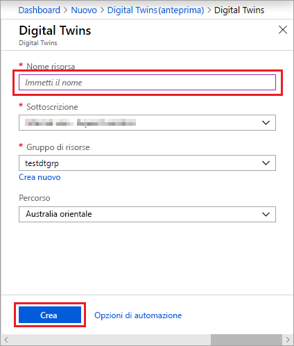
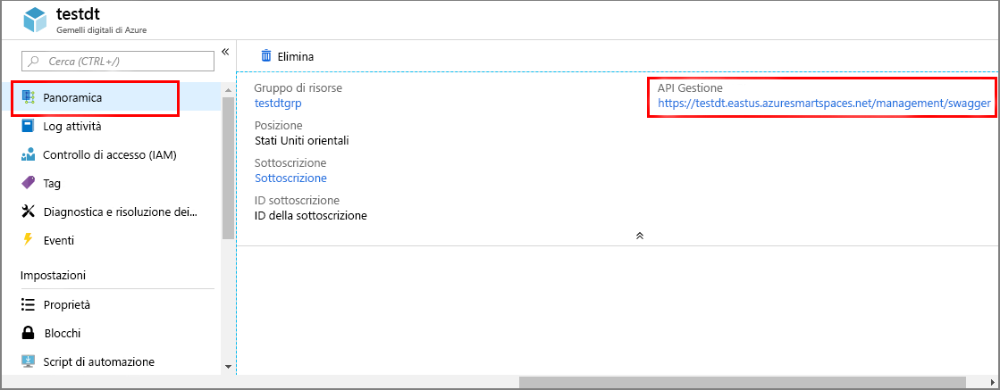

1. Accedere al [portale di Azure](http://portal.azure.com).

1. Nel riquadro di spostamento a sinistra fare clic su **Crea una risorsa**. Cercare *gemelli digitali* e selezionare **Gemelli digitali (anteprima)**. Fare quindi clic su **Crea** per avviare il processo di distribuzione.

    

1. Nel riquadro **Gemelli digitali** immettere le informazioni seguenti:
   * **Nome risorsa**: creare un nome univoco per l'istanza di Gemelli digitali.
   * **Sottoscrizione**: scegliere la sottoscrizione da usare per creare questa istanza di Gemelli digitali. 
   * **Gruppo di risorse**: selezionare o creare un [gruppo di risorse](https://docs.microsoft.com/azure/azure-resource-manager/resource-group-overview#resource-groups) per l'istanza di Gemelli digitali.
   * **Località:** selezionare la località più vicina ai dispositivi.

    

1. Rivedere le informazioni relative a Gemelli digitali e quindi fare clic su **Crea**. La creazione dell'istanza di Gemelli digitali può richiedere qualche minuto. È possibile monitorare lo stato di avanzamento nel riquadro **Notifiche**.

1. Aprire il riquadro **Panoramica** dell'istanza di Gemelli digitali. Si noti il collegamento visualizzato sotto **API gestione**.

    1. L'URL **API gestione** ha il formato: **_https://yourDigitalTwinsName.yourLocation.azuresmartspaces.net/management/swagger_**. Questo URL consente di passare alla documentazione dell'API REST di Gemelli digitali di Azure appropriata per l'istanza. Per informazioni su come leggere e usare la documentazione di questa API, leggere [How to use Azure Digital Twins Swagger](../articles/digital-twins/how-to-use-swagger.md) (Come usare Swagger di Gemelli digitali).

    1. Modificare il formato dell'URL**API gestione** in questo modo: **_https://yourDigitalTwinsName.yourLocation.azuresmartspaces.net/management/api/v1.0/_**. L'applicazione userà l'URL modificato come URL di base per l'accesso all'istanza. Copiare l'URL modificato in un file temporaneo. Sarà necessario nella prossima sezione.

    