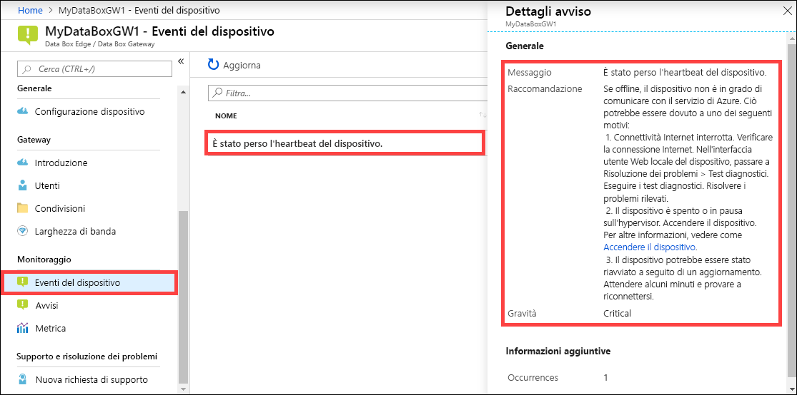

Eseguire i passaggio seguenti nel portale di Azure per visualizzare un evento del dispositivo.

1. Nel portale di Azure selezionare la risorsa Data Box Edge/Data Box Gateway e quindi passare a **Monitoraggio > Eventi del dispositivo**.
2. Selezionare un evento e visualizzare i dettagli dell'avviso. Adottare le misure appropriate per risolvere la condizione di avviso.

    