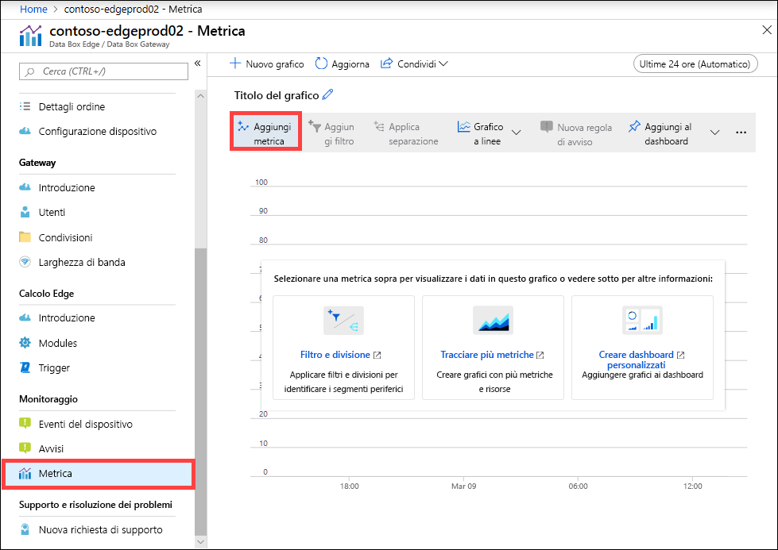
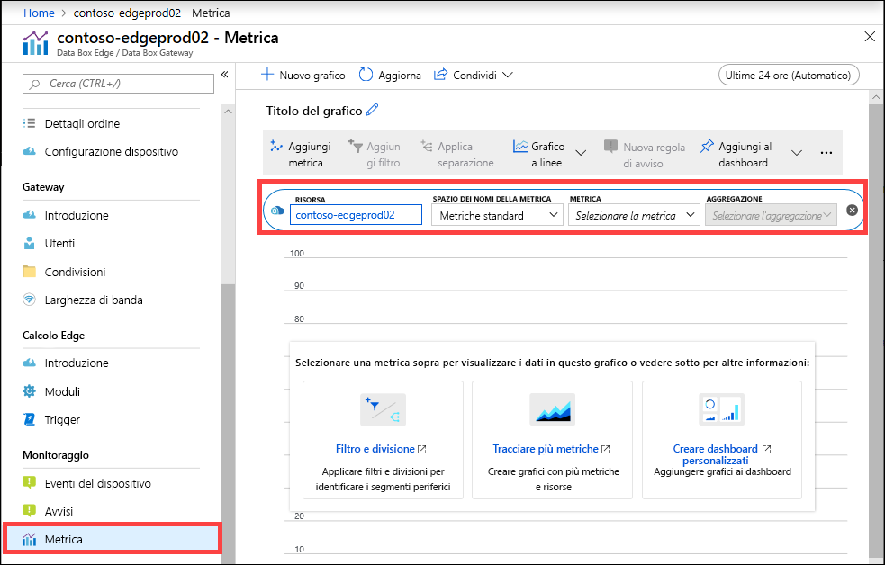
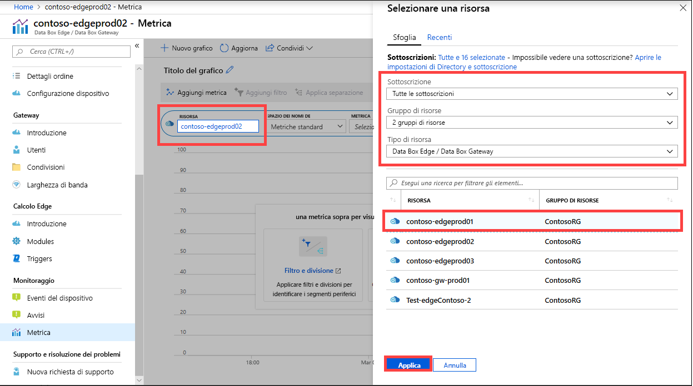
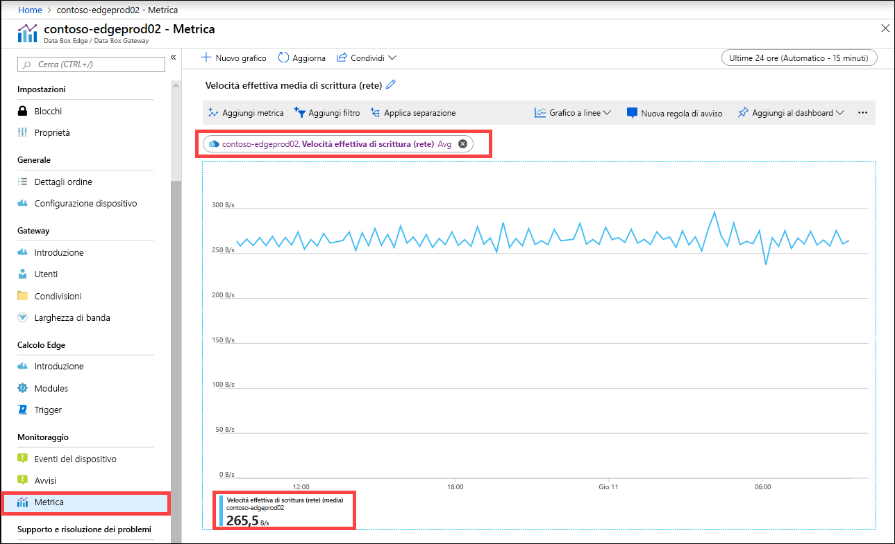
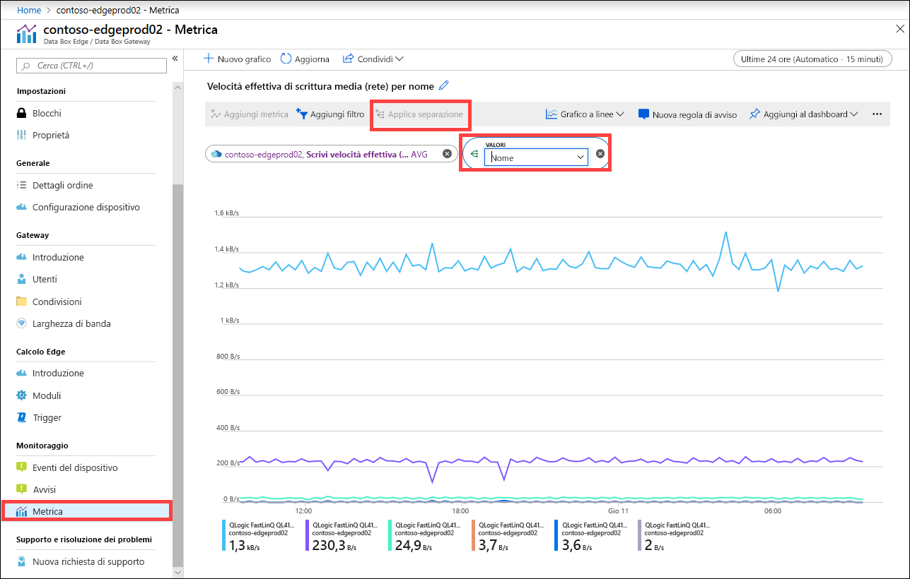
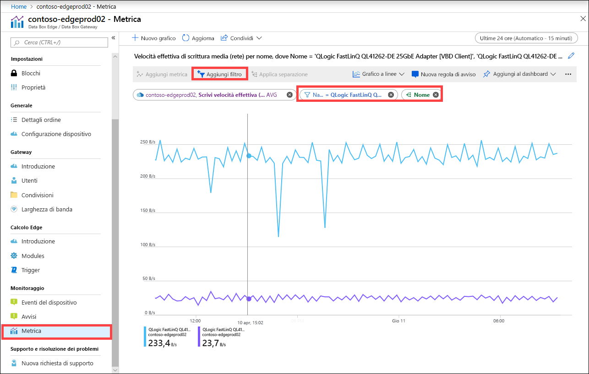
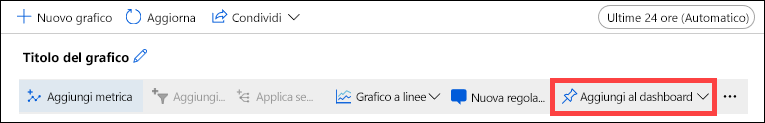

È anche possibile visualizzare le metriche per monitorare le prestazioni del dispositivo e in alcuni casi per la risoluzione dei problemi del dispositivo.

Eseguire i passaggi seguenti nel portale di Azure per creare un grafico per le metriche selezionate del dispositivo.

1. Per la risorsa nel portale di Azure, passare a **Monitoraggio > Metrica** e selezionare **Aggiungi metrica**.

    

2. La risorsa viene inserita automaticamente.  

    

    Per specificare un'altra risorsa, selezionare quella desiderata. Nel pannello **Seleziona una risorsa** selezionare la sottoscrizione, il gruppo di risorse, il tipo di risorsa e la risorsa specifica per cui si vogliono visualizzare le metriche e selezionare **Applica**.

    

3. Nell'elenco a discesa selezionare una metrica in base a cui monitorare il dispositivo. Le metriche possono essere **metriche della capacità** o **metriche di transazione**. Le metriche della capacità sono relative alla capacità del dispositivo. Le metriche di transazione sono relative alle operazioni di lettura e scrittura in Archiviazione di Azure.

    |Metriche della capacità                     |Descrizione  |
    |-------------------------------------|-------------|
    |**Capacità disponibile**               | Si riferisce alle dimensioni dei dati che possono essere scritti nel dispositivo. In altre parole, è la capacità che può essere resa disponibile nel dispositivo.   È possibile liberare la capacità del dispositivo eliminando la copia locale dei file che hanno una copia nel dispositivo e nel cloud.        |
    |**Capacità totale**                   | Si riferisce ai byte totali nel dispositivo in cui scrivere i dati. È detta anche dimensioni totali della cache locale.    È possibile aumentare la capacità di un dispositivo virtuale esistente tramite l'aggiunta di un disco dati. Aggiungere un disco dati tramite la gestione dell'hypervisor per la macchina virtuale e quindi riavviare la macchina virtuale. Il pool di archiviazione locale del dispositivo gateway si espanderà per adattarsi al disco dati appena aggiunto.   Per altre informazioni, vedere [Add a hard drive for Hyper-V virtual machine](https://www.youtube.com/watch?v=EWdqUw9tTe4) (Aggiungere un disco rigido per la macchina virtuale Hyper-V). |
    
    |Metriche di transazione              | Descrizione         |
    |-------------------------------------|---------|
    |**Byte cloud caricati (dispositivo)**    | Somma di tutti i byte caricati in tutte le condivisioni nel dispositivo.        |
    |**Byte cloud caricati (condivisione)**     | Byte caricati per condivisione. Può trattarsi di:    Medio, ovvero la somma di tutti i byte caricati per condivisione/numero di condivisioni    Massimo, ovvero il numero massimo di byte caricati da una condivisione   Minimo, ovvero il numero massimo di byte caricati da una condivisione      |
    |**Velocità effettiva download cloud (condivisione)**| Byte scaricati per condivisione. Può trattarsi di:    Medio, ovvero la somma di tutti i byte letti o scaricati in una condivisione/numero di condivisioni    Massimo, ovvero il numero massimo di byte scaricati da una condivisione   Minimo, ovvero il numero minimo di byte scaricati da una condivisione  |
    |**Velocità effettiva lettura cloud**            | Somma di tutti i byte letti dal cloud in tutte le condivisioni nel dispositivo.     |
    |**Velocità effettiva caricamento cloud**          | Somma di tutti i byte scritti nel cloud in tutte le condivisioni nel dispositivo.     |
    |**Velocità effettiva caricamento cloud (condivisione)**  | Somma di tutti i byte scritti nel cloud da una condivisione/numero di condivisioni medio, massimo e minimo per condivisione      |
    |**Velocità effettiva lettura (rete)**           | Include la velocità effettiva della rete di sistema per tutti i byte letti dal cloud. Questa visualizzazione può includere dati che non sono limitati alle condivisioni.   La suddivisione mostrerà il traffico su tutte le schede di rete nel dispositivo, incluse quelle non connesse o abilitate.      |
    |**Velocità effettiva scrittura (rete)**       | Include la velocità effettiva della rete di sistema per tutti i byte scritti nel cloud. Questa visualizzazione può includere dati che non sono limitati alle condivisioni.   La suddivisione mostrerà il traffico su tutte le schede di rete nel dispositivo, incluse quelle non connesse o abilitate.          |
    |**Calcolo Edge - Utilizzo memoria**      | Questa metrica non è applicabile per Data Box Gateway e di conseguenza non è popolata.          |
    |**Calcolo Edge - Percentuale CPU**    | Questa metrica non è applicabile per Data Box Gateway e di conseguenza non è popolata.         |

4. Quando si seleziona una metrica nell'elenco a discesa, è anche possibile definire l'aggregazione. Per aggregazione si intende il valore effettivo aggregato nell'intervallo di tempo specificato. I valori aggregati possono essere medi, minimi o massimi. Selezionare Medio, Minimo o Massimo per l'aggregazione.

    

5. Se la metrica selezionata ha più istanze, è disponibile l'opzione di suddivisione. Selezionare **Applica suddivisione** e quindi selezionare il valore in base a cui visualizzare la suddivisione.

    

6. Se ora si vuole visualizzare la suddivisione solo per alcune istanze, è possibile filtrare i dati. Ad esempio, in questo caso, se si vuole visualizzare la velocità effettiva di rete solo per le due interfacce di rete connesse nel dispositivo, è possibile filtrare tali interfacce. Selezionare **Aggiungi filtro** e specificare il nome dell'interfaccia di rete per il filtro.

    

7. È anche possibile aggiungere il grafico al dashboard per accedervi facilmente.

    

8. Per esportare i dati del grafico in un foglio di calcolo di Excel o ottenere un collegamento al grafico che è possibile condividere, selezionare l'opzione di condivisione dalla barra dei comandi.

    