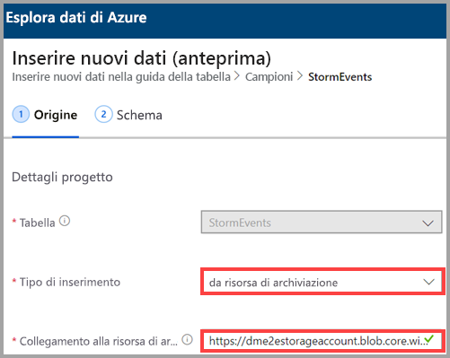
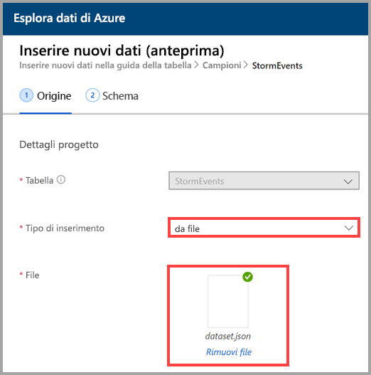
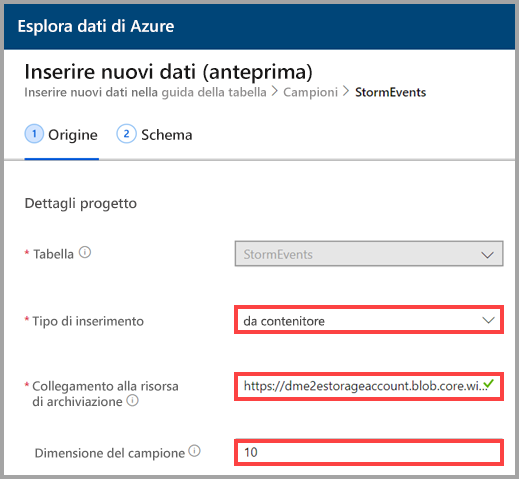
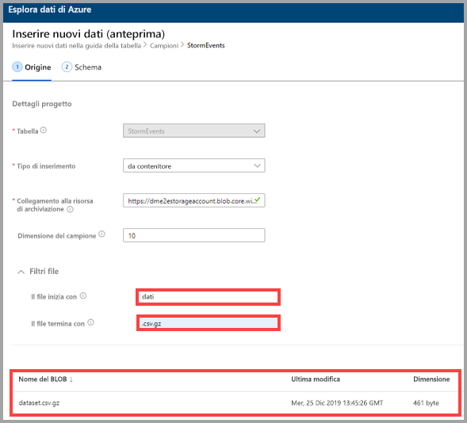

## Selezionare un tipo di inserimento

In **Ingestion type** (Tipo di inserimento) selezionare una delle opzioni seguenti:
   * **from storage** (da account di archiviazione): nel campo **Link to storage** (Collega ad account di archiviazione) aggiungere l'URL dell'account di archiviazione. Usare [URL di firma di accesso condiviso del BLOB](/azurevs-azure-tools-storage-explorer-blobs#get-the-sas-for-a-blob-container) per gli account di archiviazione privati.
   
      

    * **from file** (da file): selezionare **Sfoglia** per individuare il file oppure trascinare il file nel campo.
  
      

    * **from container** (da contenitore): nel campo **Link to storage** (Collega all'account di archiviazione) aggiungere l'[URL della firma di accesso condiviso](/azure/vs-azure-tools-storage-explorer-blobs#get-the-sas-for-a-blob-container) del contenitore e facoltativamente immettere le dimensioni del campione.

      

  Viene visualizzato un campione dei dati. Se si vuole, è possibile filtrarlo in modo da visualizzare solo i file che iniziano con caratteri specifici. Quando si modificano i filtri, l'anteprima viene aggiornata automaticamente.
  
  Ad esempio, è possibile filtrare tutti i file che iniziano con la parola *data* e terminano con un'estensione *.csv.gz*.

  
