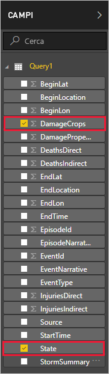
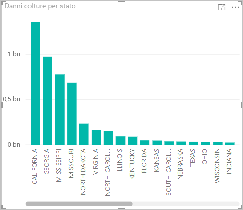

Ora che sono presenti dati in Power BI Desktop, è possibile creare report basati su tali dati. Si creerà un report semplice con un istogramma che mostra i danni alle colture per stato.

1. Sul lato sinistro della finestra principale di Power BI selezionare la visualizzazione report.

    

1. Nel riquadro**VISUALIZZAZIONI** selezionare l'istogramma a colonne di cluster.

    

    Un grafico vuoto viene aggiunto al pannello Canvas.

    

1. Nell'elenco **CAMPI** selezionare **DamageCrops** e **State**.

    

    Si ha ora un grafico che mostra i danni alle colture per le prime 1000 righe della tabella.

    

1. Salvare il report.