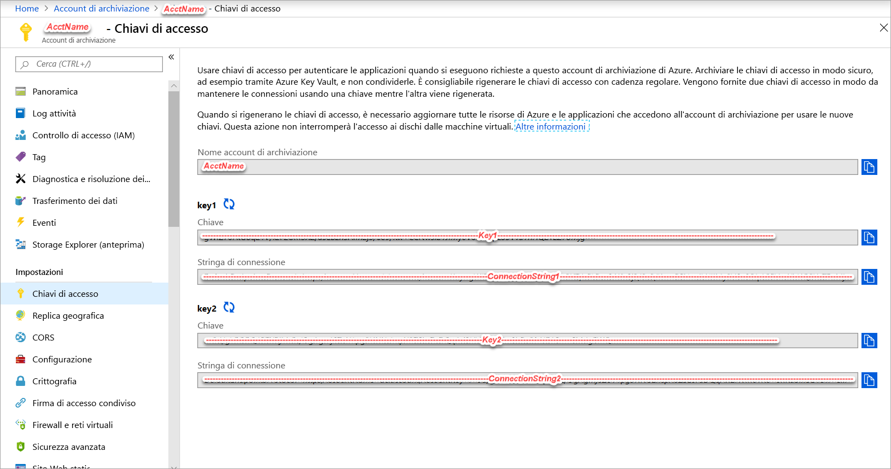
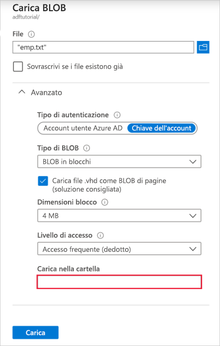

## <a name="prerequisites"></a>Prerequisiti

### <a name="azure-subscription"></a>Sottoscrizione di Azure
Se non si ha una sottoscrizione di Azure, creare un account [gratuito](https://azure.microsoft.com/free/) prima di iniziare.

### <a name="azure-roles"></a>Ruoli di Azure
Per creare istanze di Data Factory, l'account utente usato per accedere ad Azure deve essere un membro dei ruoli **collaboratore** o **proprietario** oppure un **amministratore** della sottoscrizione di Azure. Nel portale di Azure fare clic sul **nome utente** nell'angolo in alto a destra e selezionare **Autorizzazioni** per visualizzare le autorizzazioni disponibili nella sottoscrizione. Se si accede a più sottoscrizioni, selezionare quella appropriata. Per istruzioni di esempio sull'aggiunta di un utente a un ruolo, vedere l'articolo [Aggiungere i ruoli](../articles/billing/billing-add-change-azure-subscription-administrator.md).

### <a name="azure-storage-account"></a>Account di archiviazione di Azure
In questa guida introduttiva si usa un account di archiviazione di Azure per utilizzo generico (specificamente, un archivio BLOB) come archivio dati sia di **origine** che di **destinazione**. Se non si ha un account di archiviazione di Azure per utilizzo generico, vedere [Creare un account di archiviazione](../articles/storage/common/storage-create-storage-account.md#create-a-storage-account) per informazioni su come crearne uno. 

#### <a name="get-storage-account-name-and-account-key"></a>Recuperare il nome e la chiave dell'account di archiviazione
In questa guida introduttiva si usano il nome e la chiave dell'account di archiviazione di Azure. La procedura seguente illustra i passaggi per recuperare il nome e la chiave dell'account di archiviazione. 

1. Avviare un Web browser e passare al [portale di Azure](https://portal.azure.com). Eseguire l'accesso con il nome utente e la password di Azure. 
2. Fare clic su **Altri servizi** nel menu a sinistra, usare la parola chiave **Archiviazione** come filtro e selezionare **Account di archiviazione**.

    
3. Nell'elenco degli account di archiviazione filtrare, se necessario, e quindi selezionare il **proprio account di archiviazione**. 
4. Nella pagina **Account di archiviazione** selezionare **Chiavi di accesso** nel menu.

    
5. Copiare i valori dei campi **Nome account di archiviazione** e **key1** negli Appunti. Incollarli in un blocco note o in qualsiasi altro editor e salvare. Verranno usati più avanti in questa guida introduttiva.   

#### <a name="create-input-folder-and-files"></a>Creare la cartella e i file di input
In questa sezione si crea un contenitore BLOB denominato **adftutorial** nell'archivio BLOB di Azure. Si crea quindi una cartella denominata **input** nel contenitore e si carica un file di esempio in tale cartella. 

1. Nella pagina **Account di archiviazione** passare a **Panoramica** e quindi fare clic su **BLOB**. 

    
2. Nella pagina **Servizio BLOB** fare clic su **+ Contenitore** sulla barra degli strumenti. 

        
3. Nella finestra di dialogo **Nuovo contenitore** immettere **adftutorial** come nome e fare clic su **OK**. 

    
4. Fare clic su **adftutorial** nell'elenco di contenitori. 

    
1. Nella pagina **Contenitore** fare clic su **Carica** sulla barra degli strumenti.  

    
6. Nella pagina **Carica BLOB** fare clic su **Avanzate**.

    
7. Avviare il **Blocco note** e creare un file denominato **emp.txt** con il contenuto seguente. Salvarlo nella cartella **c:\ADFv2QuickStartPSH**. Creare la cartella **ADFv2QuickStartPSH** se non esiste già.
    
    ```
    John, Doe
    Jane, Doe
    ```    
8. Nella pagina **Carica BLOB** del portale di Azure cercare e selezionare il file **emp.txt** nel campo **File**. 
9. Immettere il valore **input** nel campo **Carica nella cartella**. 

        
10. Verificare che la cartella sia **input** e il file sia **emp.txt** e fare clic su **Carica**.
11. Verranno visualizzati il file **emp.txt** e lo stato del caricamento nell'elenco. 
12. Chiudere la pagina **Carica BLOB** facendo clic su **X** nell'angolo. 

    
1. Tenere aperta la pagina **Contenitore** perché verrà usata per verificare l'output alla fine di questa guida introduttiva.