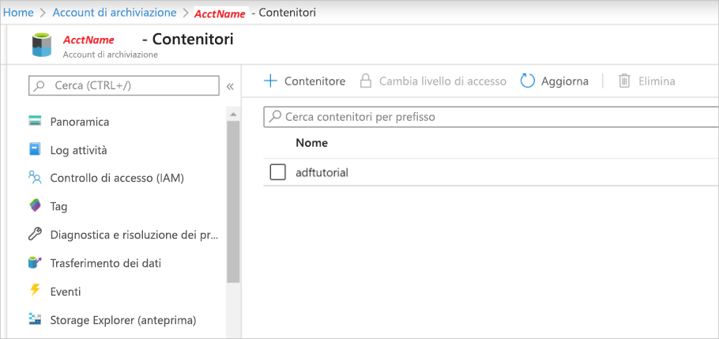

## <a name="prerequisites"></a>Prerequisiti

### <a name="azure-subscription"></a>Sottoscrizione di Azure
Se non si ha una sottoscrizione di Azure, creare un [account gratuito](https://azure.microsoft.com/free/) prima di iniziare.

### <a name="azure-roles"></a>Ruoli di Azure
Per creare istanze di Data Factory, l'account utente usato per accedere ad Azure deve essere un membro del ruolo *collaboratore* o *proprietario* oppure un *amministratore* della sottoscrizione di Azure. Per visualizzare le autorizzazioni disponibili nella sottoscrizione, passare al [portale di Azure](https://portal.azure.com), selezionare il nome utente nell'angolo in alto a destra, selezionare **Altre opzioni** (...) e quindi selezionare **Autorizzazioni personali**. Se si accede a più sottoscrizioni, selezionare quella appropriata.

Per creare e gestire le risorse figlio per Data Factory, inclusi i set di dati, i servizi collegati, le pipeline, i trigger e i runtime di integrazione, sono applicabili i requisiti seguenti:

- Per creare e gestire le risorse figlio nel portale di Azure, è necessario appartenere al ruolo **Collaboratore Data Factory** a livello di gruppo di risorse o superiore.
- Per creare e gestire le risorse figlio con PowerShell o l'SDK, è sufficiente il ruolo di **collaboratore** a livello di risorsa o superiore.

Per istruzioni di esempio su come aggiungere un utente a un ruolo, vedere l'articolo [Aggiungere i ruoli](../articles/billing/billing-add-change-azure-subscription-administrator.md).

Per altre informazioni, vedere gli articoli seguenti:

- [Ruolo Collaboratore Data Factory](../articles/role-based-access-control/built-in-roles.md#data-factory-contributor)
- [Roles and permissions for Azure Data Factory](../articles/data-factory/concepts-roles-permissions.md) (Ruoli e autorizzazioni per Azure Data Factory)

### <a name="azure-storage-account"></a>Account di archiviazione di Azure
In questa guida introduttiva si usa un account di archiviazione di Azure per utilizzo generico (specificamente, di archiviazione BLOB) come archivio dati sia di *origine* che di *destinazione*. Se non si ha un account di archiviazione di Azure per utilizzo generico, vedere [Creare un account di archiviazione](../articles/storage/common/storage-quickstart-create-account.md) per informazioni su come crearne uno. 

#### <a name="get-the-storage-account-name-and-account-key"></a>Recuperare il nome e la chiave dell'account di archiviazione
Per questa guida introduttiva è necessario avere il nome e la chiave dell'account di archiviazione di Azure. La procedura seguente illustra i passaggi per recuperare il nome e la chiave dell'account di archiviazione: 

1. In un Web browser passare al [portale di Azure](https://portal.azure.com) e accedere usando il nome utente e la password di Azure.
2. Selezionare **Tutti i servizi** > **Archiviazione** > **Account di archiviazione**.
3. Nella pagina **Account di archiviazione** filtrare gli account di archiviazione, se necessario, quindi selezionare il proprio account di archiviazione. 
4. Dalla barra laterale della pagina *\<Nome account>*  - **Account di archiviazione** passare all'etichetta **Impostazioni** e selezionare **Chiavi di accesso**. Viene visualizzato *\<Nome account>*  - **Chiavi di accesso**.

   
5. Copiare negli Appunti i valori delle caselle **Nome account di archiviazione** e **key1**. Incollarli in un blocco note o in qualsiasi altro editor e salvarli. Verranno usati più avanti in questa guida introduttiva.   

#### <a name="create-a-blob-container"></a>Creare un contenitore BLOB
In questa sezione viene creato un contenitore BLOB denominato **adftutorial** nell'archivio BLOB di Azure.

1. Dalla barra laterale della pagina *\<Nome account>*  - **Chiavi di accesso** selezionare **Panoramica** > **BLOB**.
2. Nella barra degli strumenti *\<Nome account>*  - **BLOB** selezionare **Contenitore**.
3. Nella finestra di dialogo **Nuovo contenitore** immettere **adftutorial** come nome e quindi fare clic su **OK**. La pagina *\<Nome account>*  - **BLOB** viene aggiornata per includere **adftutorial** nell'elenco dei contenitori.

   

#### <a name="add-an-input-folder-and-file-for-the-blob-container"></a>Aggiungere una cartella di input e un file per il contenitore BLOB
In questa sezione verrà creata una cartella denominata **input** nel contenitore appena creato, quindi si caricherà un file di esempio in tale cartella. Prima di iniziare, aprire un editor di testo come il **Blocco note** e creare un file denominato **emp.txt** con il contenuto seguente:

```emp.txt
John, Doe
Jane, Doe
```

Salvare il file nella cartella **C:\ADFv2QuickStartPSH**. Se la cartella non esiste, crearla. Tornare al portale di Azure e seguire questa procedura:

1. Dal punto in cui ci si trovava nella pagina *\<Nome account>*  - **BLOB** selezionare **adftutorial** nell'elenco aggiornato dei contenitori. Se la finestra è stata chiusa o ci si è spostati su un'altra pagina, accedere nuovamente al [portale di Azure](https://portal.azure.com), selezionare **Tutti i servizi** > **Archiviazione** > **Account di archiviazione**, selezionare l'account di archiviazione e quindi selezionare **BLOB** > **adftutorial**.
2. Nella barra degli strumenti della pagina del contenitore **adftutorial** selezionare **Carica**.
3. Nella pagina **Carica BLOB** selezionare la casella **File**, quindi individuare e selezionare il file **emp.txt**.
4. Espandere l'intestazione **Avanzate**. La pagina viene ora visualizzata come illustrato di seguito:

   
5. Nella casella **Carica nella cartella** immettere **input**.
6. Selezionare il pulsante **Carica**. Verranno visualizzati il file **emp.txt** e lo stato del caricamento nell'elenco.
7. Selezionare l'icona **Chiudi** (una **X**) per chiudere la pagina **Carica BLOB**.

Lasciare aperta la pagina del contenitore **adftutorial**. perché verrà usata per verificare l'output alla fine di questa guida introduttiva.