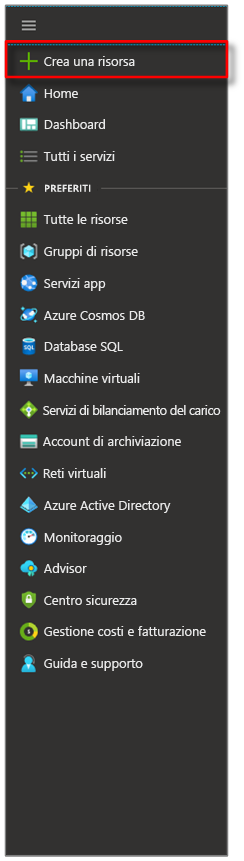
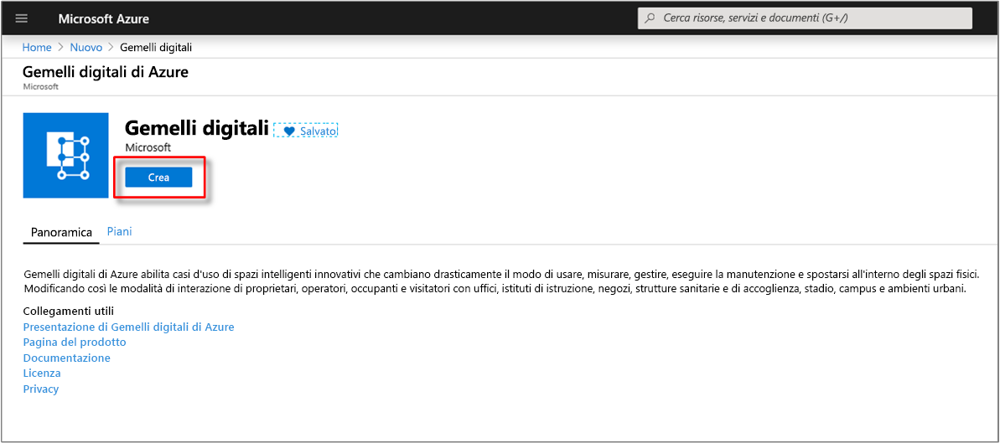

1. Accedere al [portale di Azure](https://portal.azure.com).

1. Selezionare la barra laterale Home, quindi **+ Crea una risorsa**. 

   [](./media/create-digital-twins-portal/create-a-resource.png#lightbox)

1. Cercare **gemelli digitali** e selezionare **Gemelli digitali**. 

   [](./media/create-digital-twins-portal/create-digital-twins.png#lightbox)

   In alternativa, selezionare **Internet delle cose** e **Gemelli digitali (anteprima)** .

1. Selezionare **Crea** per avviare il processo di distribuzione.

   [](./media/create-digital-twins-portal/create-and-confirm-resource.png#lightbox)

1. Nel riquadro **Gemelli digitali** immettere le informazioni seguenti:
   * **Nome risorsa**: Creare un nome univoco per l'istanza di Gemelli digitali.
   * **Sottoscrizione** scegliere la sottoscrizione da usare per creare questa istanza di Gemelli digitali. 
   * **Gruppo di risorse**: selezionare o creare un [gruppo di risorse](https://docs.microsoft.com/azure/azure-resource-manager/resource-group-overview#resource-groups) per l'istanza di Gemelli digitali.
   * **Località**: selezionare la località più vicina ai dispositivi.

     [](./media/create-digital-twins-portal/create-digital-twins-param.png#lightbox)

1. Rivedere le informazioni relative a Gemelli digitali e quindi selezionare **Crea**. La creazione dell'istanza di Gemelli digitali può richiedere qualche minuto. È possibile monitorare lo stato di avanzamento nel riquadro **Notifiche**.

1. Aprire il riquadro **Panoramica** dell'istanza di Gemelli digitali. Si noti il collegamento sotto **API Gestione**. Il formato dell'URL dell'**API di gestione** è: 
   
   ```URL
   https://yourDigitalTwinsName.yourLocation.azuresmartspaces.net/management/swagger
   ```
   
   Questo URL consente di passare alla documentazione dell'API REST di Gemelli digitali di Azure appropriata per l'istanza. Per informazioni su come leggere e usare la documentazione di questa API, leggere [How to use Azure Digital Twins Swagger](../articles/digital-twins/how-to-use-swagger.md) (Come usare Swagger di Gemelli digitali). Copiare e modificare il formato dell'URL dell'**API di gestione** in questo modo: 
    
   ```URL
   https://yourDigitalTwinsName.yourLocation.azuresmartspaces.net/management/api/v1.0/
   ```
    
   L'applicazione userà l'URL modificato come URL di base per l'accesso all'istanza. Copiare l'URL modificato in un file temporaneo. Questo URL servirà nella sezione successiva.

   [](./media/create-digital-twins-portal/digital-twins-management-api.png#lightbox)