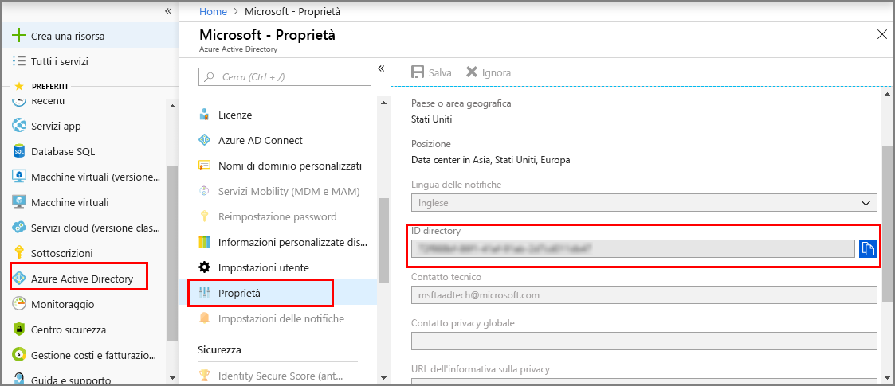
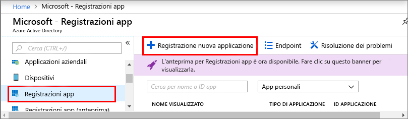
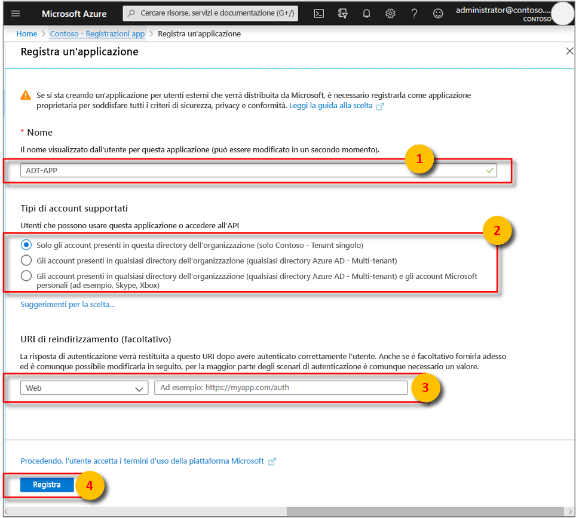
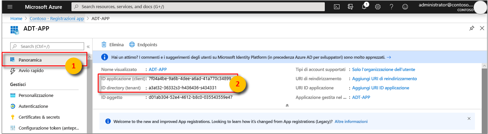
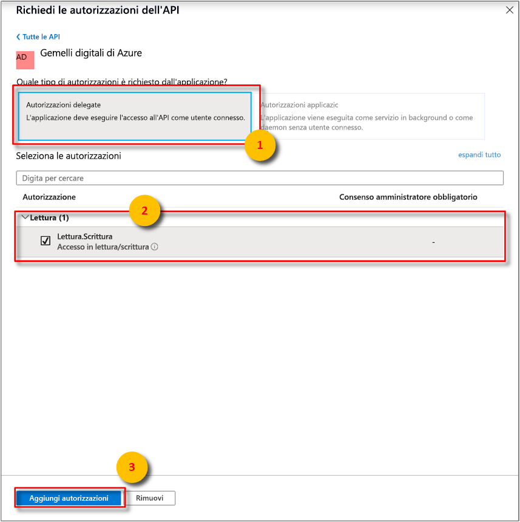

1. Nel [portale di Azure](https://portal.azure.com) aprire **Azure Active Directory** nel riquadro sinistro e quindi aprire il riquadro **Proprietà**. Copia il valore di **ID directory** in un file temporaneo. Questo valore verrà usato per configurare un'applicazione di esempio nella sezione successiva.

    

1. Aprire il riquadro **Registrazioni app** e quindi selezionare il pulsante **Registrazione nuova applicazione**.

    

1. Assegnare un nome descrittivo a questa registrazione app nella casella **Nome**. Scegliere **Nativa** per **Tipo di applicazione** e `https://microsoft.com` per **URI di reindirizzamento**. Selezionare **Crea**.

    

1. Aprire l'app registrata e copiare il valore del campo **ID applicazione** in un file temporaneo. Questo valore identifica l'app di Azure Active Directory. L'ID applicazione verrà usato per configurare l'applicazione di esempio nelle sezioni seguenti.

    

1. Aprire il riquadro Registrazioni app. Selezionare **Impostazioni** > **Autorizzazioni necessarie** e quindi:

   a. Selezionare **Aggiungi** in alto a sinistra per aprire il riquadro **Aggiungi accesso all'API**.

   b. Scegliere **Selezionare un'API** e cercare **Gemelli digitali di Azure**. Se la ricerca non individua l'API, cercare invece **Azure Smart Spaces**.

   c. Selezionare l'opzione **Azure Digital Twins (Azure Smart Spaces Service)** (Gemelli digitali di Azure - servizio Azure Smart Spaces) e scegliere **Seleziona**.

   d. Scegliere **Selezionare le autorizzazioni**. Selezionare la casella di controllo delle autorizzazioni delegate **Accesso in lettura/scrittura** e scegliere **Seleziona**.

   e. Selezionare **Fine** nel riquadro **Aggiungi accesso all'API**.

   f. Nel riquadro **Autorizzazioni necessarie** selezionare il pulsante **Concedi autorizzazioni** e accettare la conferma visualizzata.

      
