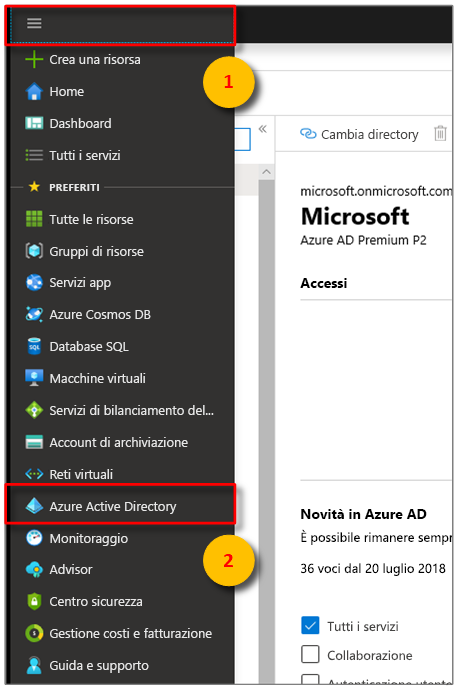

>[!NOTE]
>Questa sezione fornisce istruzioni relative alla [registrazione app di Azure AD](https://docs.microsoft.com/azure/active-directory/develop/quickstart-register-app).

1. Nel [portale di Azure](https://portal.azure.com) aprire **Azure Active Directory** dal menu sinistro espandibile e quindi aprire il riquadro **Registrazioni app**. 

    

1. Selezionare il pulsante **+ Nuova registrazione**.

    

1. Assegnare un nome descrittivo a questa registrazione app nella casella **Nome**. Nella sezione **URI di reindirizzamento (facoltativo)** scegliere **Client pubblico/nativo (per dispositivi mobili e desktop)** nel menu a discesa a sinistra e immettere `https://microsoft.com` nella casella di testo a destra. Selezionare **Registra**.

    

1. Per assicurarsi che [l'app sia registrata come **client pubblico**](https://docs.microsoft.com/azure/active-directory/develop/scenario-desktop-app-registration), aprire il riquadro **Autenticazione** per la registrazione app e scorrere verso il basso. Nella sezione **Tipo di client predefinito** scegliere **Sì** per **Consente di gestire l'applicazione come un client pubblico**, quindi premere **Salva**.

    Selezionare **Token di accesso** per abilitare l'impostazione **oauth2AllowImplicitFlow** nel file Manifest.json.

    

1.  Aprire il riquadro**Panoramica** dell'app registrata e copiare i valori delle entità seguenti in un file temporaneo. Questi valori verranno usati per configurare l'applicazione di esempio nelle sezioni seguenti.

    - **ID applicazione (client)**
    - **ID della directory (tenant)**

    

1. Aprire il riquadro **Autorizzazioni API** per la app registrazione app. Selezionare il pulsante **+ Aggiungi un'autorizzazione**. Nel riquadro **Richiedi le autorizzazioni dell'API** selezionare la scheda **API usate dall'organizzazione** e quindi cercare uno degli elementi seguenti:
    
    1. `Azure Digital Twins`. Selezionare l'API **Gemelli digitali di Azure**.

        

    1. In alternativa, cercare `Azure Smart Spaces Service`. Selezionare l'API **Azure Smart Spaces Service** (Servizio Spazi intelligenti Azure).

        

    > [!IMPORTANT]
    > Il nome e l'ID dell'API di Azure AD che verranno visualizzati dipendono dal tenant:
    > * Gli account dei clienti e dei tenant di test devono cercare `Azure Digital Twins`.
    > * Gli altri account Microsoft devono cercare `Azure Smart Spaces Service`.

1. L'API selezionata viene visualizzata come **Gemelli digitali di Azure** nello stesso riquadro **Richiedi le autorizzazioni dell'API**. Selezionare l'opzione a discesa **Lettura**  e quindi la casella di controllo **Read.Write**. Selezionare il pulsante **Aggiungi autorizzazioni**.

    

1. A seconda delle impostazioni dell'organizzazione, potrebbe essere necessario eseguire passaggi aggiuntivi per concedere l'accesso amministratore a questa API. Contattare l'amministratore per altre informazioni. Una volta approvato l'accesso amministratore, la colonna **Consenso amministratore obbligatorio** nel riquadro **Autorizzazioni API** mostra le autorizzazioni. 

    

    Verificare che venga visualizzato **Gemelli digitali di Azure**.
