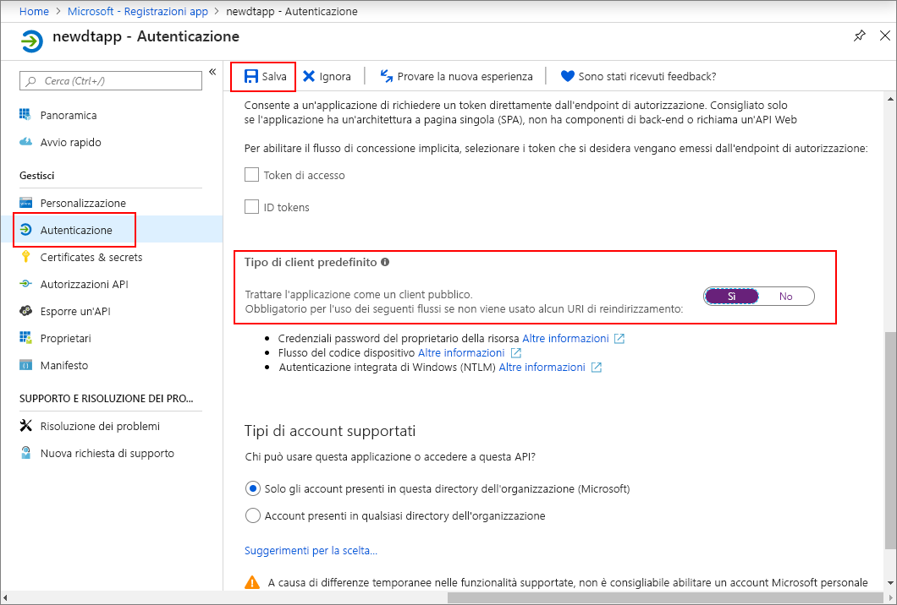
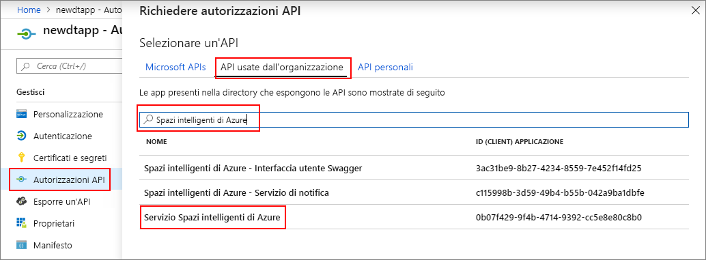
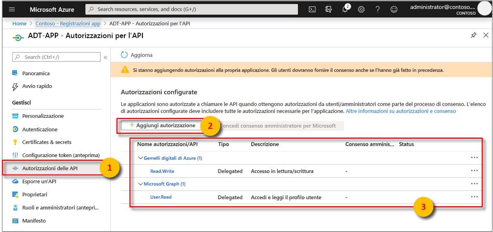

>[!NOTE]
>Questa sezione fornisce istruzioni relative alla [nuova esperienza di registrazione app Azure AD](https://docs.microsoft.com/azure/active-directory/develop/quickstart-register-app). Se sono ancora presenti registrazioni app native legacy, è possibile continuare a usarle se sono ancora supportate. Se inoltre per qualche motivo la nuova modalità di registrazione app non funziona nella configurazione in uso, è possibile provare a creare un'app AAD nativa legacy. Vedere [Registrare un'app Gemelli digitali di Azure con Azure Active Directory legacy](../articles/digital-twins/how-to-use-legacy-aad.md) per altre informazioni. 

1. Nel [portale di Azure](https://portal.azure.com) aprire **Azure Active Directory** dal riquadro sinistro e quindi aprire il riquadro **Registrazioni app**. Selezionare il pulsante **Nuova registrazione**.

    

1. Assegnare un nome descrittivo a questa registrazione app nella casella **Nome**. Nella sezione **URI di reindirizzamento (facoltativo)** scegliere **Client pubblico (per dispositivi mobili e desktop)** nel menu a discesa a sinistra e immettere `https://microsoft.com` nella casella di testo a destra. Selezionare **Registra**.

    

1. Per assicurarsi che [l'app sia registrata come *app nativa*](https://docs.microsoft.com/azure/active-directory/develop/scenario-desktop-app-registration), aprire il riquadro **Autenticazione** per la registrazione app e scorrere verso il basso. Nella sezione **Tipo di client predefinito** scegliere **Sì** per **Consente di gestire l'applicazione come un client pubblico**. 

    

1.  Aprire il riquadro**Panoramica** dell'app registrata e copiare i valori delle entità seguenti in un file temporaneo. Questi valori verranno usati per configurare l'applicazione di esempio nelle sezioni seguenti.

    - **ID applicazione (client)**
    - **ID della directory (tenant)**

    

1. Aprire il riquadro **Autorizzazioni API** per la app registrazione app. Selezionare il pulsante **Aggiungi un'autorizzazione**. Nel riquadro **Richiedi le autorizzazioni dell'API** selezionare la scheda **API usate dall'organizzazione** e quindi cercare **Azure Smart Spaces** (Spazi intelligenti Azure). Selezionare l'API **Azure Smart Spaces Service** (Servizio Spazi intelligenti Azure).

    

1. L'API selezionata viene visualizzata come **Gemelli digitali di Azure** nello stesso riquadro **Richiedi le autorizzazioni dell'API**. Selezionare il menu a discesa **Lettura (1)** e quindi la casella di controllo **Read.Write**. Selezionare il pulsante **Aggiungi autorizzazioni**.

    

1. A seconda delle impostazioni dell'organizzazione, potrebbe essere necessario eseguire passaggi aggiuntivi per concedere l'accesso amministratore a questa API. Contattare l'amministratore per altre informazioni. Una volta approvato l'accesso amministratore, la colonna **CONSENSO AMMINISTRATORE OBBLIGATORIO** nel riquadro **Autorizzazioni API** sarà simile a quanto illustrato di seguito per le API:

    

