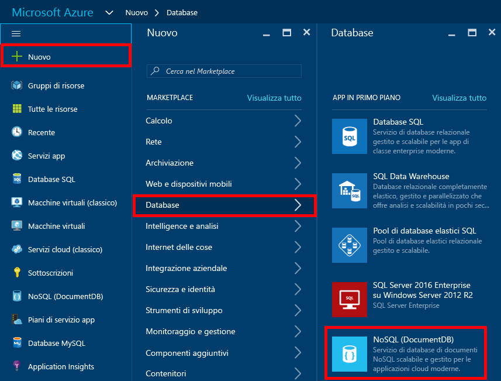
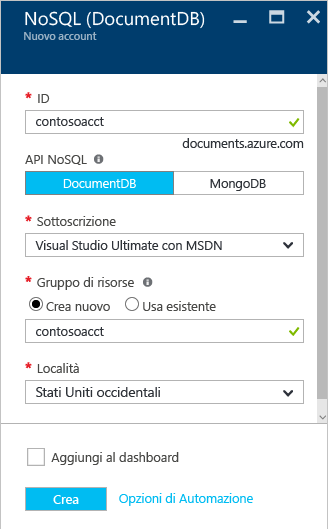
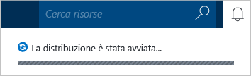
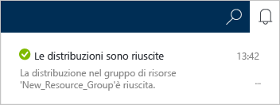

1.	Accedere al [portale di Microsoft Azure](https://portal.azure.com/) online.
2.	Nell'indice scegliere **Nuovo**, selezionare **Dati + archiviazione**, quindi fare clic su **DocumentDB**. 
  
	

3. Nel pannello **Nuovo account DocumentDB** specificare la configurazione desiderata per l'account DocumentDB.
 
	

	- Nella casella **ID** immettere un nome per identificare l'account DocumentDB. Quando l’**ID** viene convalidato, appare un segno di spunta verde nella casella **ID**. Il valore **ID** diventa il nome host nell'URI. L'**ID** può contenere solo lettere minuscole, numeri e il carattere '-' e deve avere una lunghezza compresa tra 3 e 50 caratteri. Tenere presente che al nome di endpoint scelto viene aggiunto *documents.azure.com* e il risultato finale sarà l'endpoint dell'account DocumentDB.
	

	- La sezione **Livello account** è bloccata perché DocumentDB supporta un solo livello account standard. Per altre informazioni, vedere [DocumentDB - Prezzi](http://go.microsoft.com/fwlink/p/?LinkID=402317&clcid=0x409).
	
	- Per **Sottoscrizione** selezionare la sottoscrizione di Azure da usare per l'account DocumentDB. Se l'account dispone solo una sottoscrizione, tale account viene selezionato per impostazione predefinita.

	- In **Gruppo di risorse** selezionare o creare un gruppo di risorse per l'account DocumentDB. Per impostazione predefinita, verrà creato un nuovo gruppo di risorse. È tuttavia possibile selezionare un gruppo di risorse esistente al quale aggiungere l'account DocumentDB. Per altre informazioni, vedere [Uso del portale di Azure per gestire le risorse di Azure](resource-group-portal.md).
 
	- Usare **Località** per specificare la posizione geografica in cui verrà ospitato l'account DocumentDB.   

4.	Dopo aver configurato le opzioni del nuovo account DocumentDB, fare clic su **Crea**.  Può richiedere alcuni minuti per creare l'account DocumentDB. Per verificare lo stato, è possibile monitorare l'avanzamento nella Schermata iniziale  
	  
  
	o dall'Hub di notifica.  

	

	

5.	Dopo aver creato l'account DocumentDB, è pronto per l'utilizzo con le impostazioni predefinite nel portale in linea. Si noti che la coerenza predefinita dell'account DocumentDB è impostata su **Sessione**. È possibile modificare l'impostazione di coerenza predefinita facendo clic sul riquadro **Uniformità predefinita** sul pannello **DocumentDB account**.

    

[How to: Create a DocumentDB account]: #Howto
[Next steps]: #NextSteps
[documentdb-manage]:../articles/documentdb/documentdb-manage.md

<!---HONumber=AcomDC_1223_2015-->