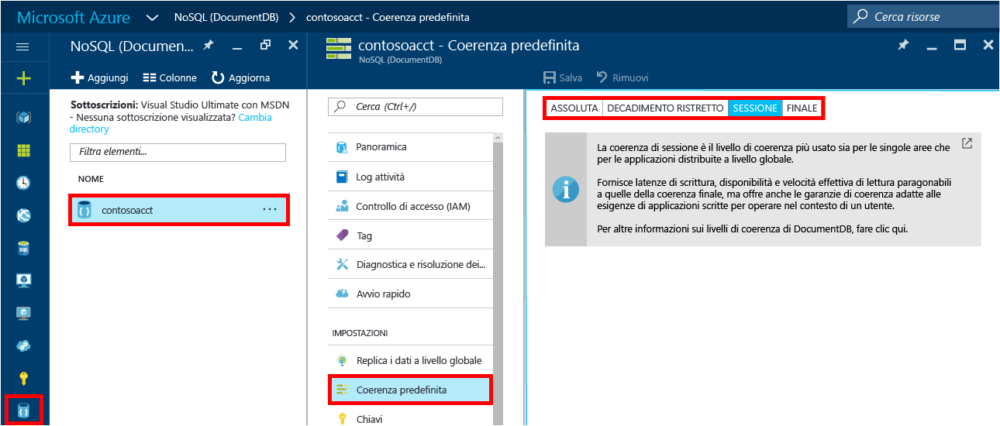

1. Accedere al [portale di Azure](https://portal.azure.com/).
2. Nell'indice scegliere **Nuovo**, fare clic su **Database** e quindi su **NoSQL (DocumentDB)**.
   
     
3. Nel pannello **Nuovo account** specificare la configurazione per l'account DocumentDB.
   
    
   
   * Nella casella **ID** immettere un nome identificativo per l'account DocumentDB.  Quando l'**ID** viene convalidato, nella casella **ID** viene visualizzato un segno di spunta verde. Il valore **ID** diventa il nome host all'interno dell'URI. L' **ID** può contenere solo lettere minuscole, numeri e il carattere '-' e deve avere una lunghezza compresa tra 3 e 50 caratteri. Si noti che al nome dell'endpoint scelto viene aggiunto *documents.azure.com* e il risultato finale sarà l'endpoint dell'account DocumentDB.
   * Nella casella **API NoSQL** selezionare **DocumentDB**.  
   * In **Sottoscrizione**selezionare la sottoscrizione di Azure da usare per l'account DocumentDB. Se l'account ha solo una sottoscrizione, viene selezionato per impostazione predefinita.
   * In **Gruppo di risorse**selezionare o creare un gruppo di risorse per l'account DocumentDB.  Per impostazione predefinita, viene creato un nuovo gruppo di risorse. Per altre informazioni, vedere [Gestire le risorse di Azure mediante il portale](../articles/azure-portal/resource-group-portal.md).
   * Usare **Località** per specificare l'area geografica in cui verrà ospitato l'account DocumentDB. 
4. Dopo aver configurato le opzioni del nuovo account DocumentDB, fare clic su **Crea**. Per controllare lo stato della distribuzione, controllare l'hub Notifiche.  
   
     
   
   
5. Dopo la creazione, l'account DocumentDB è pronto all'uso con le impostazioni predefinite. Per rivedere le impostazioni predefinite, fare clic sull'icona **NoSQL (DocumentDB)** nell'indice, selezionare il nuovo account e quindi fare clic su **Coerenza predefinita** nel menu della risorsa.

     

   La coerenza predefinita dell'account DocumentDB è impostata su **Sessione**.  Per modificarla è possibile fare clic su **Coerenza predefinita** nel menu della risorsa. Per altre informazioni sui livelli di coerenza offerti da DocumentDB, vedere [Livelli di coerenza in DocumentDB](../articles/documentdb/documentdb-consistency-levels.md).

[How to: Create a DocumentDB account]: #Howto
[Next steps]: #NextSteps
[documentdb-manage]:../articles/documentdb/documentdb-manage.md

<!--HONumber=Dec16_HO2-->

