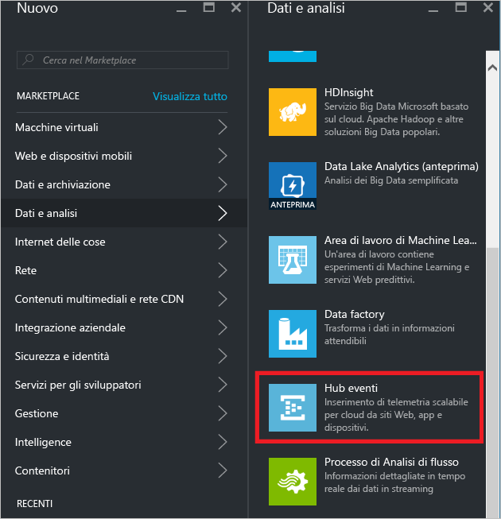
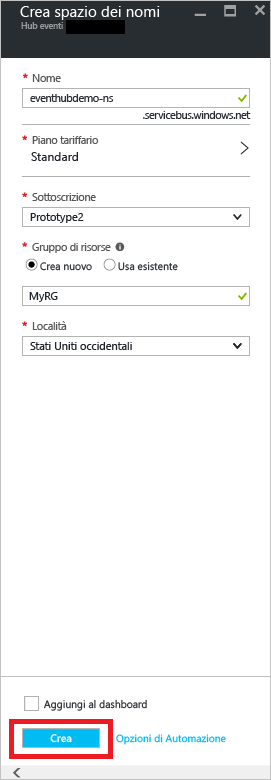
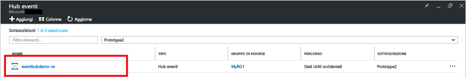
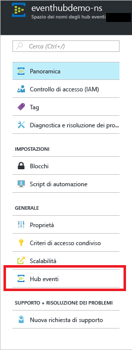
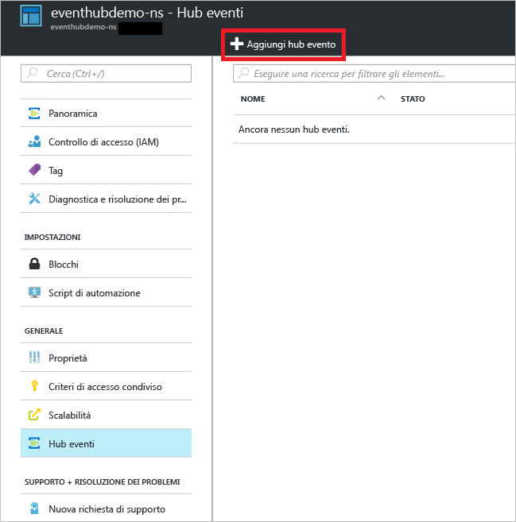
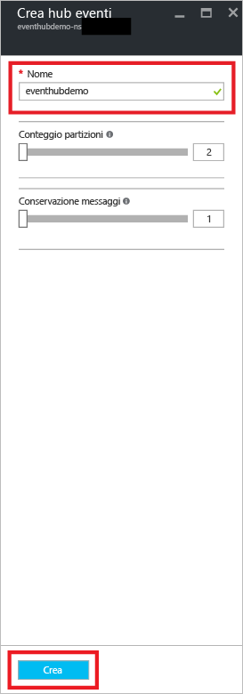
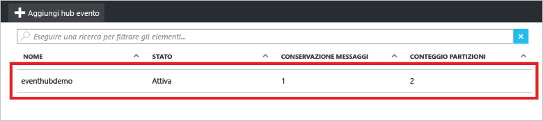
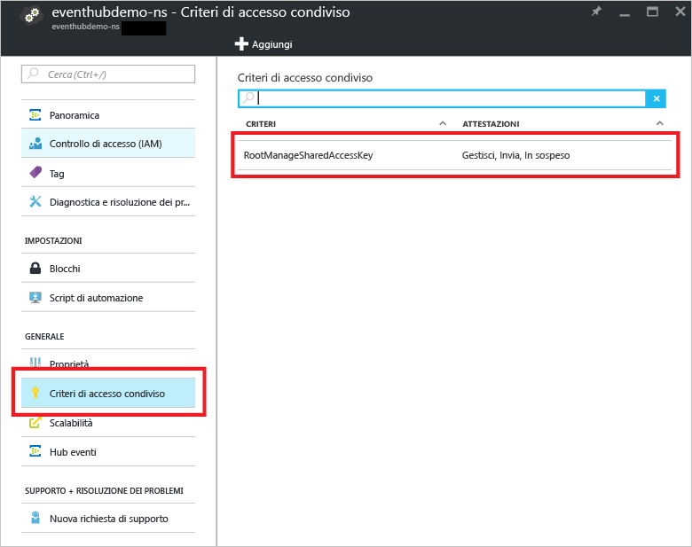
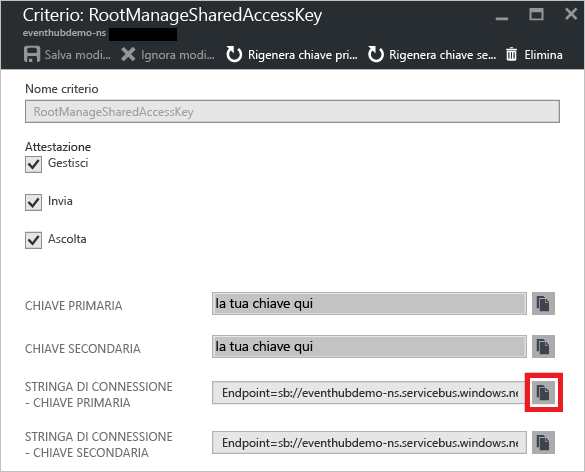

## Creare un hub eventi

1. Accedere al [portale di Azure][] e fare clic su **Nuovo** nella parte superiore sinistra della schermata.

2. Fare clic su **Dati e analisi** e quindi su **Hub eventi**.

	



3. Nel pannello **Crea spazio dei nomi** immettere un nome per lo spazio dei nomi. Verrà effettuato immediatamente un controllo sulla disponibilità del nome.

	



4. Dopo aver verificato che il nome dello spazio dei nomi sia disponibile, scegliere il piano tariffario (Basic o Standard). Scegliere anche una sottoscrizione, un gruppo di risorse e una località di Azure in cui creare la risorsa.

2. Fare clic su **Crea** per creare lo spazio dei nomi.

6. Nell'elenco degli spazi dei nomi di Hub eventi fare clic sullo spazio dei nomi appena creato.

	



7. Nel pannello dello spazio dei nomi fare clic su **Hub eventi**.

	



8. Nella parte superiore del pannello fare clic su **Aggiungi hub eventi**.

	



3. Digitare un nome per l'hub eventi e quindi fare clic su **Crea**.

	



4. Nell'elenco degli hub eventi fare clic sul nome dell'hub eventi appena creato.

	



5. Nel pannello dello spazio dei nomi (non in quello dello specifico hub eventi) fare clic su **Criteri di accesso condiviso** e quindi su **RootManageSharedAccessKey**.

	



5. Fare clic sul pulsante di copia per copiare la stringa di connessione **RootManageSharedAccessKey** negli Appunti. Salvare questa stringa di connessione per usarla più avanti nell'esercitazione.

	

L'hub eventi è stato creato e sono disponibili le stringhe di connessione necessarie per inviare e ricevere eventi.

[portale di Azure]: https://portal.azure.com/

<!---HONumber=AcomDC_0921_2016-->